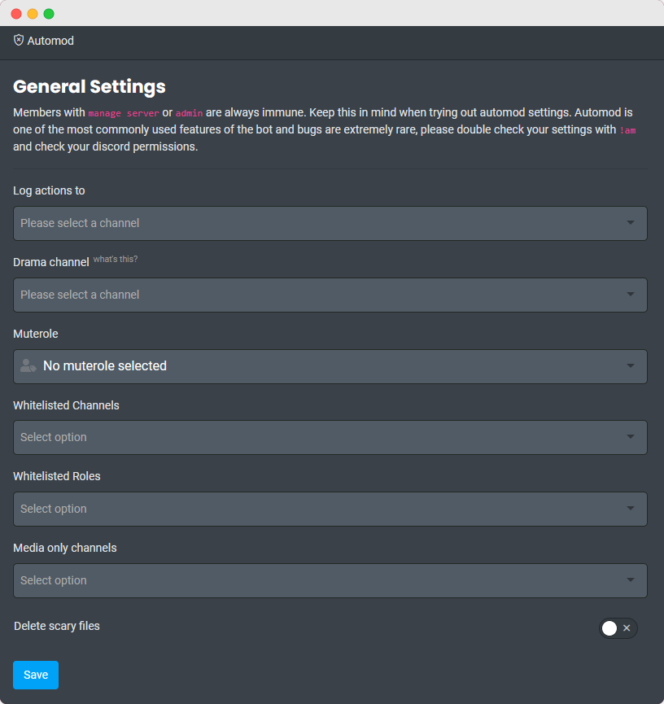

?> It is highly recommended to use the **[Dashboard](https://carl.gg)** for setting up automod.

## General Settings

<!-- tabs:start -->

<!-- tab:Slash Commands -->

| Name                                                                                                      | Example                                   | Usage                                                                                                                                          |
| --------------------------------------------------------------------------------------------------------- | ----------------------------------------- | ---------------------------------------------------------------------------------------------------------------------------------------------- |
| **automod server** Manage Server                                 | `/automod server`                         | Shows an overview of the current automod settings.                                                                                             |
| **automod drama** \<channel> Manage Server                       | `/automod drama #drama`                   | This is a [Premium](https://carl.gg/get-premium) command. Set the channel where mods can make decisions on rule breakers through reactions. |
| **automod log** \<channel> Manage Server                         | `/automod log #automod`                   | Set the channel where the logs for automatic moderation actions go.                                                                            |
| **automod media** <channels...> Manage Server                    | `/automod mo #show-off`                   | Set the channel(s) where only posting images/links is allowed.                                                                                 |
| **automod unmedia** <channels...> Manage Server                  | `/automod umo #show-off`                  | Removes the media-only restriction from one or more channels.                                                                                  |
| **automod whitelist channels** <choice> <channels> Manage Server | `/automod whitelist channels add #admins` | Add or remove channels from the automod whitelist.                                                                                             |
| **automod whitelist roles** <choice> <roles> Manage Server       | `/automod whitelist roles add mods`       | Add or remove roles from the automod whitelist.                                                                                                |
| **automod deletefiles** Manage Server                            | `/automod deletefiles`                    | Toggles deleting unsafe files. Safe formats include png, jpg, jpeg, gif, svg, bmp, tif, webp, webm, mp4, mov, pdf, txt, mp3, flac and wav.     |

<!-- tab:Mention Commands -->

| Name                                                                                                    | Example                              | Usage                                                                                                                                          |
| ------------------------------------------------------------------------------------------------------- | ------------------------------------ | ---------------------------------------------------------------------------------------------------------------------------------------------- |
| [**am**\|**automod**] Manage Server                            | `@Carl-bot am`                       | Shows an overview of the current automod settings.                                                                                             |
| **automod drama** \<channel> Manage Server                     | `@Carl-bot am drama #drama`          | This is a [Premium](https://carl.gg/get-premium) command. Set the channel where mods can make decisions on rule breakers through reactions. |
| **automod log** \<channel> Manage Server                       | `@Carl-bot am log #automod`          | Set the channel where the logs for automatic moderation actions go.                                                                            |
| **automod** [media\|mo] <channels...> Manage Server            | `@Carl-bot am mo #show-off`          | Set the channel(s) where only posting images/links is allowed.                                                                                 |
| **automod** [unmedia\|umo\|unmo] <channels...> Manage Server   | `@Carl-bot am umo #show-off`         | Removes the media-only restriction from one or more channels.                                                                                  |
| **automod** [whitelist\|wl] <roles/channels> Manage Server     | `@Carl-bot am wl mods #admin-chat`   | Whitelists roles and/or channels so that the automod ignores messages posted in/by them.                                                       |
| **automod** [unwhitelist\|unwl] <roles/channels> Manage Server | `@Carl-bot am unwl mods #admin-chat` | Removes roles and/or channels from the automod whitelist.                                                                                      |
| **deletefiles** Manage Server                                  | `@Carl-bot deletefiles`              | Toggles deleting unsafe files. Safe formats include png, jpg, jpeg, gif, svg, bmp, tif, webp, webm, mp4, mov, pdf, txt, mp3, flac and wav.     |

<!-- tabs:end -->

### Punishments

The punishments available are:

- **delete** - Deletes the message.
- **warn** - Warns the offender.
- **tempmute <duration>** - Temporarily mutes for the duration specified.
- **mute** - Mute for indefinite duration.
- **timeout** - Timeout the offender.
- **kick** - Kicks the offender.
- **tempban <duration>** - Temporarily bans the offender for the duration specified.
- **ban** - Bans the offender.
- **defer** - Sends the context to the drama channel and lets the mods vote on it.
- **message** - Sends a message to the channel warning the member.
- **dm/pm** - Sends a private message to the offender.

?> Input the duration in this format `3h42m`.

?> You can add more than one punishment by separating them with commas.

## Warn Threshold

Warns do not automatically expire. Managing warns is detailed on the [Moderation](moderation) page. The warn threshold determines how Carl-bot reacts when a user receives a new warning and their total number of warnings exceeds a limit. Unless a user's warnings are reset or reduced manually, this punishment will trigger each time a user receives new warning while their total number of warnings is above your server's set limit. Set it to 0 to turn it off.

<!-- tabs:start -->

<!-- tab:Slash Commands -->

| Name                                                                                           | Example                    | Usage                                                |
| ---------------------------------------------------------------------------------------------- | -------------------------- | ---------------------------------------------------- |
| **automod threshold** \<limit> Manage Server          | `/automod threshold 5`     | Sets the warn threshold for a punishment to be made. |
| **automod warnpunish** <punishments...> Manage Server | `/automod warnpunish kick` | Sets the punishment for hitting the threshold.       |

<!-- tab:Mention Commands -->

| Name                                                                                                 | Example                | Usage                                                |
| ---------------------------------------------------------------------------------------------------- | ---------------------- | ---------------------------------------------------- |
| **automod** [warn\|threshold] \<limit> Manage Server        | `@Carl-bot am warn 5`  | Sets the warn threshold for a punishment to be made. |
| **automod** [warnpunish\|wp] <punishments...> Manage Server | `@Carl-bot am wp kick` | Sets the punishment for hitting the threshold.       |

<!-- tabs:end -->

## Spam Settings

<!-- tabs:start -->

<!-- tab:Message -->

Message spam will not be active without setting a rate limit of at least 1+ messages in 1+ seconds first.

!> Once activated, the bot will delete the message that triggered the automod even if the punishment doesn't include `delete`. If `message` punishment is included, the warning message will also be deleted after 5 seconds.

<!-- tabs:start -->

<!-- tab:Slash Commands -->

| Name                                                                                                    | Example                                             | Usage                                                                                                                                                                                    |
| ------------------------------------------------------------------------------------------------------- | --------------------------------------------------- | ---------------------------------------------------------------------------------------------------------------------------------------------------------------------------------------- |
| **automod slowmode set** \<rate> Manage Server                 | `/automod slowmode set 5 25`                        | Sets slowmode in the current channel. If you want the rate to be X messages in Y time then input `x y`. If only one value is supplied then it sets it as 1 message every supplied value. |
| **automod slowmode disable** Manage Server                     | `/automod slowmode disable`                         | Disables slowmode in the current channel.                                                                                                                                                |
| **automod slowmode punishment** <punishments...> Manage Server | `/automod slowmode punishment delete, tempmute 20m` | Sets the punishment(s) for hitting the rate limit.                                                                                                                                       |

<!-- tab:Mention Commands -->

| Name                                                                                                         | Example                                     | Usage                                                                                                                                               |
| ------------------------------------------------------------------------------------------------------------ | ------------------------------------------- | --------------------------------------------------------------------------------------------------------------------------------------------------- |
| [**slowmode**\|**sm**] [rate] [per] Manage Server                   | `@Carl-bot slowmode 5 25`                   | Rate is the number of messages you can send per timeframe. Per is the timeframe. If you only supply one value, it sets that value as the per. (1/x) |
| **slowmode** [punishment\|punish\|p] <punishments...> Manage Server | `@Carl-bot slowmode p delete, tempmute 20m` | Sets the punishment(s) for hitting the rate limit.                                                                                                  |

<!-- tabs:end -->

<!-- tab:Attachments -->

Attachmentspam will not be active without setting a rate limit of at least 1+ files in 1+ seconds first.

<!-- tabs:start -->

<!-- tab:Slash Commands -->

| Name                                                                                                          | Example                                          | Usage                                                                            |
| ------------------------------------------------------------------------------------------------------------- | ------------------------------------------------ | -------------------------------------------------------------------------------- |
| **automod attachmentspam set** \<rate> Manage Server                 | `/automod attachmentspam set 3 5`                | Rate limits the number of attachments a member can post in a specific timeframe. |
| **automod attachmentspam disable** Manage Server                     | `/automod attachmentspam disable`                | Disables attachmentspam in the current channel.                                  |
| **automod attachmentspam punishment** <punishments...> Manage Server | `/automod attachmentspam punishment mute, defer` | Sets the punishment(s) for hitting the rate limit.                               |

<!-- tab:Mention Commands -->

| Name                                                                                                  | Example                                  | Usage                                                                                                    |
| ----------------------------------------------------------------------------------------------------- | ---------------------------------------- | -------------------------------------------------------------------------------------------------------- |
| **attachmentspam** [rate] [per=1] Manage Server              | `@Carl-bot attachmentspam 3 5`           | Rate limits the number of attachments a member can post in a specific timeframe. Leave blank to disable. |
| **attachmentspam punishment** <punishments...> Manage Server | `@Carl-bot attachmentspam p mute, defer` | Sets the punishment(s) for hitting the rate limit.                                                       |

<!-- tabs:end -->

<!-- tab:Mentions -->

Mentionspam will not be active without setting a rate limit of at least 1+ mentions in 1+ seconds first.

<!-- tabs:start -->

<!-- tab:Slash Commands -->

| Name                                                                                                            | Example                                       | Usage                                                        |
| --------------------------------------------------------------------------------------------------------------- | --------------------------------------------- | ------------------------------------------------------------ |
| **automod mentionspam set** \<rate> Manage Server                      | `/automod mentionspam set 25 5`               | Enables the bot to automatically punish the mentionspammers. |
| **automod mentionspam disable** Manage Server                          | `/automod mentionspam disable`                | Disables mentionspam in the current channel.                 |
| **automod mentionspam punishment** <punishments...=mute> Manage Server | `/automod mentionspam punishment tempban 24h` | Sets the punishment(s) for hitting the rate limit.           |

<!-- tab:Mention Commands -->

| Name                                                                                                    | Example                               | Usage                                                        |
| ------------------------------------------------------------------------------------------------------- | ------------------------------------- | ------------------------------------------------------------ |
| **mentionspam** [rate] [per=1] Manage Server                   | `@Carl-bot mentionspam 25 5`          | Enables the bot to automatically punish the mentionspammers. |
| **mentionspam punishment** <punishments...=mute> Manage Server | `@Carl-bot mentionspam p tempban 24h` | Sets the punishment(s) for hitting the rate limit.           |

<!-- tabs:end -->

<!-- tab:Links -->

Linkspam will not be active without setting a rate limit of at least 1+ links in 1+ seconds first.

<!-- tabs:start -->

<!-- tab:Slash Commands -->

| Name                                                                                                           | Example                                                     | Usage                                                                 |
| -------------------------------------------------------------------------------------------------------------- | ----------------------------------------------------------- | --------------------------------------------------------------------- |
| **automod linkspam server** Manage Server                             | `/automod linkspam server`                                  | Shows the linkspam settings.                                          |
| **automod linkspam rate** \<rate> Manage Server                       | `/automod linkspam rate 1 1`                                | Sets the link rate limit. Use the example command to block all links. |
| **automod linkspam punishment** <punishments...> Manage Server        | `/automod linkspam punishment delete, mute, defer`          | Sets the punishment(s) for hitting the rate limit.                    |
| **automod linkspam blacklist** [add\|remove] <links...> Manage Server | `/automod linkspam blacklist add reddit.com twitter.com`    | Adds or removes link(s) to/from the linkspam blacklist.               |
| **automod linkspam whitelist** [add\|remove] <links...> Manage Server | `/automod linkspam whitelist remove reddit.com twitter.com` | Adds or removes link(s) to/from the linkspam whitelist.               |
| **automod linkspam clear** [blacklist\|whitelist] Manage Server       | `/automod linkspam clear blacklist`                         | Clears the blacklist or the whitelist.                                |
| **automod linkspam block** Manage Server                              | `/automod linkspam block`                                   | Punish all non-whitelisted links.                                     |
| **automod linkspam off** Manage Server                                | `/automod linkspam off`                                     | Punish only blacklisted links.                                        |
| **automod linkspam norole** Manage Server                             | `/automod linkspam norole`                                  | Punish only those without roles.                                      |

<!-- tab:Mention Commands -->

| Name                                                                                            | Example                                          | Usage                                                                 |
| ----------------------------------------------------------------------------------------------- | ------------------------------------------------ | --------------------------------------------------------------------- |
| **linkspam** Manage Server                             | `@Carl-bot linkspam`                             | Shows the current settings.                                           |
| **linkspam** \<rate> [per=1] Manage Server             | `@Carl-bot linkspam 1 1`                         | Sets the link rate limit. Use the example command to block all links. |
| **linkspam punishment** <punishments...> Manage Server | `@Carl-bot linkspam p delte, mute, defer`        | Sets the punishment(s) for hitting the rate limit.                    |
| **linkspam bl** <links...> Manage Server               | `@Carl-bot linkspam bl reddit.com twitter.com`   | Blacklists one or more links.                                         |
| **linkspam wl** <links...> Manage Server               | `@Carl-bot linkspam wl reddit.com twitter.com`   | Whitelists one or more links.                                         |
| **linkspam unbl** <links...> Manage Server             | `@Carl-bot linkspam unbl reddit.com twitter.com` | Removes one or more links from the blacklist.                         |
| **linkspam unwl** <links...> Manage Server             | `@Carl-bot linkspam unwl reddit.com twitter.com` | Removes one or more links from the whitelist.                         |
| **linkspam clearbl** Manage Server                     | `@Carl-bot linkspam clearbl`                     | Clears the blacklist.                                                 |
| **linkspam clearwl** Manage Server                     | `@Carl-bot linkspam clearwl`                     | Clears the whitelist.                                                 |
| **linkspam block** Manage Server                       | `@Carl-bot linkspam block`                       | Punish all non-whitelisted links.                                     |
| **linkspam off** Manage Server                         | `@Carl-bot linkspam off`                         | Punish only blacklisted links.                                        |
| **linkspam norole** Manage Server                      | `@Carl-bot linkspam norole`                      | Punish only those without roles.                                      |

<!-- tabs:end -->

<!-- tab:Invites -->

You can enable and disable this feature through the dashboard.

<!-- tabs:start -->

<!-- tab:Slash Commands -->

| Name                                                                                                      | Example                                                       | Usage                                              |
| --------------------------------------------------------------------------------------------------------- | ------------------------------------------------------------- | -------------------------------------------------- |
| **automod invitespam server** Manage Server                      | `/automod invitespam server`                                  | Shows the invitespam settings.                     |
| **automod invitespam punishment** <punishments...> Manage Server | `/automod invitespam punishment delete, mute, defer, message` | Sets the punishment(s) for hitting the rate limit. |
| **automod invitespam norole** Manage Server                      | `/automod invitespam norole`                                  | Punish only those without roles.                   |

<!-- tab:Mention Commands -->

| Name                                                                                              | Example                                                        | Usage                                              |
| ------------------------------------------------------------------------------------------------- | -------------------------------------------------------------- | -------------------------------------------------- |
| **invitespam** Manage Server                             | `@Carl-bot invitespam`                                         | Shows the invitespam settings.                     |
| **invitespam punishment** <punishments...> Manage Server | `@Carl-bot invitespam punishment delete, mute, defer, message` | Sets the punishment(s) for hitting the rate limit. |
| **invitespam norole** Manage Server                      | `@Carl-bot invitespam norole`                                  | Punish only those without roles.                   |

<!-- tabs:end -->

<!-- tab:Bad Words -->

Bad words detection is case insensitive, looks for substrings and ignores punctuation. Censoring `boat` would cause Carl-bot to punish any user that said `fredboat`.

?> **Limit** 50 Entries

<!-- tabs:start -->

<!-- tab:Slash Commands -->

| Name                                                                                                                | Example                                          | Usage                                                                    |
| ------------------------------------------------------------------------------------------------------------------- | ------------------------------------------------ | ------------------------------------------------------------------------ |
| **automod censor server** Manage Server                                    | `/automod censor server`                         | View censor settings for server.                                         |
| **automod censor words** [add\|remove] <words...> Manage Server            | `/automod censor words add boat`                 | Adds or removes one or more words to/from the list of blacklisted words. |
| **automod censor display** Manage Server                                   | `/automod censor display`                        | Lists all censored words.                                                |
| **automod censor clear** Manage Server                                     | `/automod censor clear`                          | Clears all censored words.                                               |
| **automod censor punishment** <punishments...=delete, defer> Manage Server | `/automod censor punishment mute, delete, defer` | Sets the punishment(s) for bad words.                                    |

<!-- tab:Mention Commands -->

| Name                                                                                                        | Example                                           | Usage                                                    |
| ----------------------------------------------------------------------------------------------------------- | ------------------------------------------------- | -------------------------------------------------------- |
| **censor** <words...> Manage Server                                | `@Carl-bot censor boat`                           | Adds one or more words to the list of blacklisted words. |
| **censor add** <words...> Manage Server                            | `@Carl-bot censor add boat`                       | Same as above.                                           |
| **censor remove** <words...> Manage Server                         | `@Carl-bot censor remove boat`                    | Removes a word from the blacklist.                       |
| **censor list** Manage Server                                      | `@Carl-bot censor list`                           | Lists all censored words.                                |
| **censor clear** Manage Server                                     | `@Carl-bot censor clear`                          | Clears all censored words.                               |
| **censor punishment** <punishments...=delete, defer> Manage Server | `@Carl-bot censor punishment mute, delete, defer` | Sets the punishment(s) for bad words.                    |

<!-- tabs:end -->

<!-- tab:Caps Limit -->

<!-- tabs:start -->

<!-- tab:Slash Commands -->

| Name                                                                                                | Example                                 | Usage                                                                                                             |
| --------------------------------------------------------------------------------------------------- | --------------------------------------- | ----------------------------------------------------------------------------------------------------------------- |
| **automod caps limit** \<percentage> Manage Server         | `/automod caps limit 70`                | Punishes messages with the % of its characters being uppercase. The message has to be at least 6 characters long. |
| **automod caps punishment** <punishments...> Manage Server | `/automod caps punishment delete, warn` | Sets the punishment(s) for sending a message which hits the threshold.                                            |

<!-- tab:Mention Commands -->

| Name                                                                                                                    | Example                        | Usage                                                                                                             |
| ----------------------------------------------------------------------------------------------------------------------- | ------------------------------ | ----------------------------------------------------------------------------------------------------------------- |
| **capslimit** \<percentage> Manage Server                                      | `@Carl-bot capslimit 70`       | Punishes messages with the % of its characters being uppercase. The message has to be at least 6 characters long. |
| [**capspunish**\|**capsp**\|**capspunishment**] <punishments...> Manage Server | `@Carl-bot capsp delete, warn` | Sets the punishment(s) for sending a message which hits the threshold.                                            |

<!-- tabs:end -->

<!-- tab:Honeypot -->

Honeypot sets existing channel in your server as a trap for spammers. Whoever sends a message in this channel will be punished.

?> **Limit** 1 Honeypot channel per server. [Premium](https://carl.gg/get-premium) servers can have 5 honeypot channels.

<!-- tabs:start -->

<!-- tab:Slash Commands -->

| Name                                                                                                                  | Example                              | Usage                                         |
| --------------------------------------------------------------------------------------------------------------------- | ------------------------------------ | --------------------------------------------- |
| **automod honeypot add** <channels...> Manage Server                         | `/automod honeypot add #honeypot`    | Adds existing channel(s) as honeypot.         |
| **automod honeypot remove** <channels...> Manage Server                      | `/automod honeypot remove #honeypot` | Removes existing channel(s) as honeypot.      |
| **automod honeypot server**  Manage Server                                   | `/automod honeypot server`           | View honeypot settings for server.            |
| **automod honeypot clear** Manage Server                                     | `/automod honeypot clear`            | Clears all honeypot settings.                 |
| **automod honeypot punishment** <punishments...=delete, defer> Manage Server | `/automod honeypot punishment ban`   | Sets the punishment(s) for honeypot triggers. |

<!-- tab:Mention Commands -->

| Name                                                                                                          | Example                               | Usage                                         |
| ------------------------------------------------------------------------------------------------------------- | ------------------------------------- | --------------------------------------------- |
| **honeypot** [**add**\|**+**] <channels...> Manage Server            | `@Carl-bot honeypot add #honeypot`    | Adds existing channel(s) as honeypot.         |
| **honeypot** [**remove**\|**-**] <channels...> Manage Server         | `@Carl-bot honeypot remove #honeypot` | Removes existing channel(s) as honeypot.      |
| **honeypot server**  Manage Server                                   | `@Carl-bot honeypot server`           | View honeypot settings for server.            |
| **honeypot clear** Manage Server                                     | `@Carl-bot honeypot clear`            | Clears all honeypot settings.                 |
| **honeypot punishment** <punishments...=delete, defer> Manage Server | `@Carl-bot honeypot punishment ban`   | Sets the punishment(s) for honeypot triggers. |

<!-- tabs:end -->

<!-- tabs:end -->

## Auto Purge

Auto Purge is a [Premium](https://carl.gg/get-premium) feature that automatically deletes messages in a channel after a set amount of time. You can configure the channel, interval, and message type to be purged. Upto 15 channels can be configured for Auto Purge. The minimum interval is 1 hour and maximum is 14 days.

<!-- tabs:start -->

<!-- tab:Slash Commands -->

| Name                                                                                                               | Example                       | Usage                                                                     |
| ------------------------------------------------------------------------------------------------------------------ | ----------------------------- | ------------------------------------------------------------------------- |
| **autopurge config** Manage Server                                        | `/autopurge config`           | Shows Auto Purge configuration.                                           |
| **autopurge set** \<channel> \<interval> [message_type=all] Manage Server | `/autopurge set #channel all` | Sets the channel and interval for Auto Purge.                             |
| **autopurge remove** [channel] Manage Server                              | `/autopurge remove #channel`  | Removes the specified channel from Auto Purge, or disable it completely.. |

<!-- tab:Mention Commands -->

| Name                                                                                                               | Example                                | Usage                                                                     |
| ------------------------------------------------------------------------------------------------------------------ | -------------------------------------- | ------------------------------------------------------------------------- |
| **autopurge** Manage Server                                               | `@Carl-bot autopurge`                  | Shows Auto Purge configuration.                                           |
| **autopurge set** \<channel> \<interval> [message_type=all] Manage Server | `@Carl-bot autopurge set #channel all` | Sets the channel and interval for Auto Purge.                             |
| **autopurge remove** [channel] Manage Server                              | `@Carl-bot autopurge remove #channel`  | Removes the specified channel from Auto Purge, or disable it completely.. |

<!-- tabs:end -->

### Message Types

| Type        | Definition                              |
| ----------- | --------------------------------------- |
| all         | All messages.                           |
| humans      | Only messages sent by humans.           |
| bots        | Only messages sent by bots.             |
| links       | Only messages that contain links.       |
| invites     | Only messages that contain invites.     |
| attachments | Only messages that contain attachments. |
