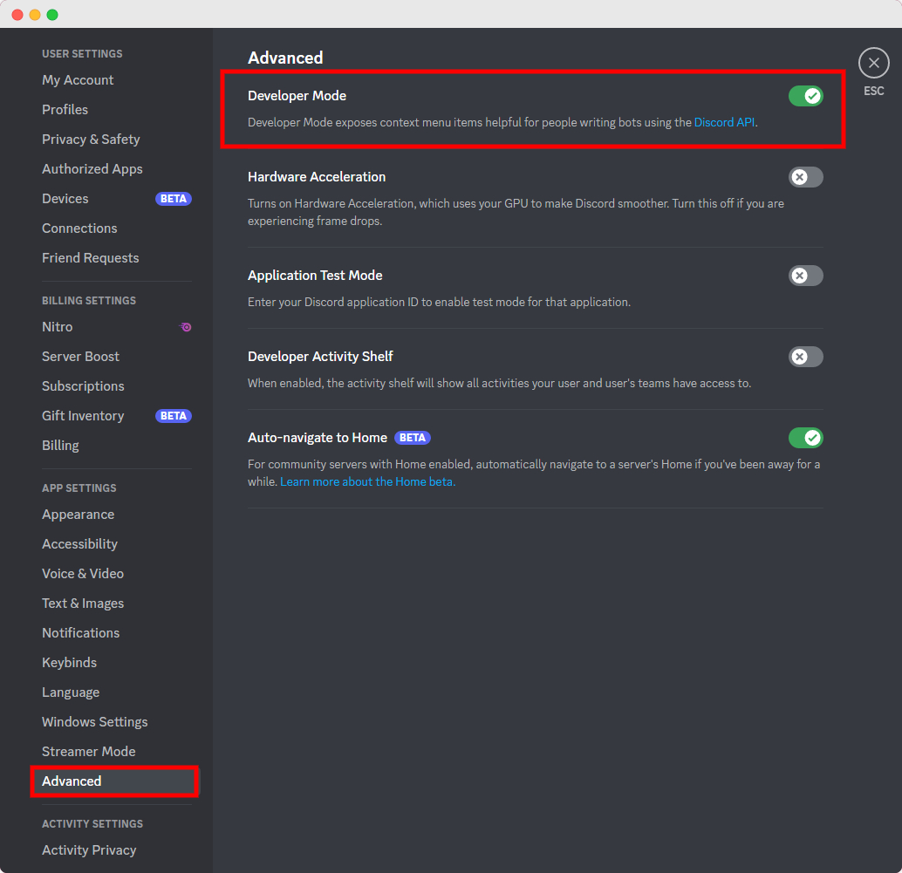
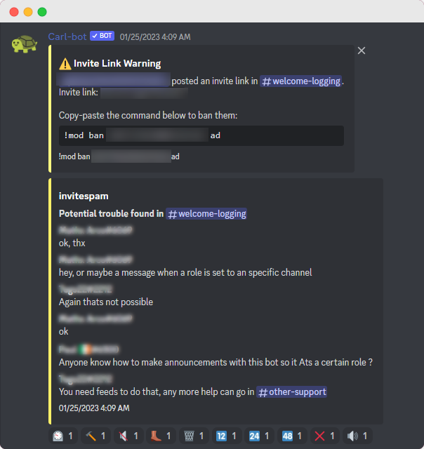

## Frequently Asked Questions {docsify-ignore}

### What is the prefix for Carl-bot? {docsify-ignore}

The default prefixes for Carl-bot are `@Carl-bot`, `?` and `!`. You can use `/prefix list` to check the prefixes for your server.

### How do I get the Message ID? {docsify-ignore}

**Right Click** the message and select **Copy ID**

?> To enable this option you would need to do the following: 
Discord Settings > Advanced > Developer Mode > Enable

### Another bot has the same command and they both respond, what do I do? {docsify-ignore}

Depends on what you're after. If you need to use both, you're pretty much forced to change the prefix of either bot. If you just want the command that is not from Carl-bot then you can disable it with `!disable <command>`. If you just want Carl-bot's command then you may create an alias using tags and `{cmd:cmdname {args}}`. Check out the Advanced Usage section in Tags category for more information.

### Why does the bot complain about requiring more permissions? I've given it Manage Roles already. {docsify-ignore}

The way Discord decides if you can add a role or not is based on two things:

- Does the Member adding the role have Manage Roles permission?
- Is the member trying to add a role higher in the role hierarchy than the bot's role?

Just assign the bot a role that is higher than the highest role it has to assign. The role being hoisted does not have to have any special permissions.

### What is the drama channel? {docsify-ignore}

This is a [Premium](https://carl.gg/get-premium) feature that aims to streamline your server's moderation. Automod is nice but it is not perfect as sometimes false positives happen. This feature was made for that exact reason. You need to:

1. Set up the drama channel on either the Dashboard or with the command `!am drama <channel>`.
2. Set the automod punishment to `Post to drama channel` on the Dashboard.

### I am missing premium slots. A different tier is shown than the one I subscribed to on Patreon. {docsify-ignore}

0. If you have any alt accounts, visit [Discord](https://discord.com) in a web browser and make sure you are logged in to the correct account.
1. Go to [Patreon's page for linking apps](https://www.patreon.com/settings/apps) and click the Connect button next to the Discord icon.
2. Click [here](https://carl.gg/api/v1/oauth/gotopatreon) to force the update.
3. If step 2 didn't work, edit anything at all on your Patreon profile or wait at least 10 minutes.
4. If the bot has not sent you a DM by now, ask for help in the [support server](https://discord.gg/S2ZkBTnd8X).
5. If none of the above work, please send an email to `support@botlabs.gg` with the subject `Carl-bot Premium Support` and add the following information:
   - Your Discord ID
   - The email address you used to subscribe to Patreon
   - The tier you subscribed to
   - A screenshot of your receipt from Patreon

### How do I transfer my premium to another server? {docsify-ignore}

To transfer your premium status to another server, you need to remove premium from the current server you have premium on with the `/premium removepremium` command. Then use the `/premium addpremium` command in the server you want to transfer your premium status to. You can also mark the server as premium from the [Dashboard](https://carl.gg/).
If you don’t access to the server where you used your premium, simply use the `/premium listpremium` command to list the server IDs where you have premium, and then you can use the `/premium removepremium` command to remove it from that server.

### The bot says I do not have the required permissions to assign that role. {docsify-ignore}

If you see that Carl-bot responds with the above message when you use a moderation command or role command, it generally means that the role (or the muted role if you are trying to mute someone) is higher than your highest role and you cannot assign or remove that role.
To resolve this issue, you need to have a role higher than the role you are trying to assign. If you are a moderator on someone's server, then ask the server admins/owner to help you achieve that.

### What is Drama Alert? {docsify-ignore}

Drama alert is a premium feature which sends the offending messages to the drama alert channel, from where the mods can react on the message and take appropriate measures.
To check all automod commands, visit the [Automod](/automod) section.

### Why is Carl-bot not responding to my commands? {docsify-ignore}

1. Check that Carl-bot is online in your member list. If not, then check the [status page](https://carl.gg/status) to see if there are any issues.
2. See if Carl-bot is missing permissions. Type `@Carl-bot ping` to make sure Carl-bot has View Channel and Send Messages permissions in the channel you are trying to use it in.
3. Check if the server's prefix has been changed. You can use `@Carl-bot prefix` to see the current prefixes.
4. Make sure the command is not disabled in the server. You can enable a command by using `@Carl-bot enable <command>`.
5. Check your overwrites by using `@Carl-bot diagnose <command>` then share the full response with the support team if you need help.

If any of these steps do not resolve the issue, please let us know so we can help you further troubleshoot the problem.

### Why does my reaction role show numbers instead of role names? {docsify-ignore}

This is because the embed title cannot show any mentions. Mentions are only possible in the description fields. To fix this issue, you need to separate the title and description with a | character as message says and put the role mentions in the description. Alternatively you can write {roles} and it will replace itself with each of the emoji role pairs.

### Sometimes edit and deleted messages are not logged. Why? {docsify-ignore}

Carl-bot will only log edited/deleted messages if the message is being updated within 1 hour from when the messages were sent. If it is longer than that, the bot does not log the original messages anymore.

### Users can still talk after being muted. Why? {docsify-ignore}

Make sure that the muted role has been applied to the user. If it has, then check the role hierarchy and make sure that the muted role is higher than the roles that allow sending messages in the channels where the user is still able to talk. You can also run the `/muterole update` command to update the muted role permissions in all channels.

### How to delete all links sent in my server? {docsify-ignore}

You can do this by setting the Automod Linkspam module to whitelist mode on the [Dashboard](https://carl.gg/). This makes it so that all links that are not whitelisted will be deleted. And you set the "Punish after" rates to enable it, and set it as per your server traffic.

### How do I stop users from using slash commands? {docsify-ignore}

Slash commands can be restricted per member, per role and per channel from the Integrations option in Server Settings.
