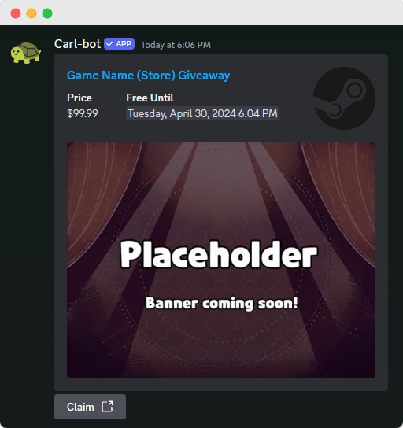

## TopRoll
Start a TopRoll game where users can try to get into the daily leaderboard. Each user tries to roll the highest sum in 6 tries in 60 seconds. The game starts when the first user starts rolling and lasts for a day.

<!-- tabs:start -->

<!-- tab:Prefix Commands -->
Name              | Example           | Usage                                                                         
 ---------------- | ----------------- | ----------------------------------------------------------------------------- 
**games toproll** | `!games toproll`  | Starts the TopRoll game.

<!-- tab:Slash Commands -->
Name              | Example           | Usage                                                                         
 ---------------- | ----------------- | ----------------------------------------------------------------------------- 
**games toproll** | `/games toproll`  | Starts the TopRoll game.

<!-- tabs:end -->

## Free Game Alerts
Get notified whenever there is a free game giveaway. Currently we only support Steam, Origin, Ubisoft, Epic Games Store, Android and GOG.

<!-- tabs:start -->

<!-- tab:Prefix Commands -->
Name              | Example           | Usage                                                                         
 ---------------- | ----------------- | ----------------------------------------------------------------------------- 
**games alerts** [enable\|disable] [channel] | `!games alerts` | Get/Set the configuration for free game alerts.

<!-- tab:Slash Commands -->
Name              | Example           | Usage                                                                         
 ---------------- | ----------------- | ----------------------------------------------------------------------------- 
**games alerts** [config] [channel] | `/games alerts` | Get/Set the configuration for free game alerts.

<!-- tabs:end -->

## Game GIFs
Sends game related GIFs. Currently we only support League of Legends.

<!-- tabs:start -->

<!-- tab:Prefix Commands -->
Name              | Example           | Usage                                                                         
 ---------------- | ----------------- | ----------------------------------------------------------------------------- 
**league** [emotion] | `!league happy` | Sends a GIF of League of Legends with the specified emotion. Random if left empty.
**leaguebomb** [emotion] | `!league happy` | Sends upto 5 GIFs of League of Legends with the specified emotion. Random if left empty.

<!-- tab:Slash Commands -->
Name              | Example           | Usage                                                                         
 ---------------- | ----------------- | ----------------------------------------------------------------------------- 
**games gif** \<choice> [emotion] [bomb] | `/games gif league` | Sends 1 or upto 5 GIFs (according to bomb) with the specified emotion or random (according to emotion) of the specified game.

<!-- tabs:end -->

## Browser Games

<!-- tabs:start -->

<!-- tab:Prefix Commands -->
Name              | Example           | Usage                                                                         
 ---------------- | ----------------- | ----------------------------------------------------------------------------- 
**games list**    | `!games list`     | Shows list of top games to play in your browser.                              
**games play**    | `!games play`     | Shows a random game to play in your browser.                                  
**games roblox**  | `!games roblox`   | Shows a link to play Roblox in your browser.                                 
**games tog**     | `!games tog`      | Shows a link to play Tower of God in your browser.                                 

<!-- tab:Slash Commands -->
Name              | Example           | Usage                                                                         
 ---------------- | ----------------- | ----------------------------------------------------------------------------- 
**games list**    | `/games list`     | Shows list of top games to play in your browser.                              
**games play**    | `/games play`     | Shows a random game to play in your browser.                                  
**games roblox**  | `/games roblox`   | Shows a link to play Roblox in your browser.                                 
**games tog**     | `/games tog`      | Shows a link to play Tower of God in your browser.                                 

<!-- tabs:end -->

## Fortnite

<!-- tabs:start -->

<!-- tab:Prefix Commands -->
Name              | Example           | Usage                                                                         
 ----------------- | ----------------- | ----------------------------------------------------------------------------- 
[**fortnite**\|**fn**] [platform=pc] \<name> | `!fn Dakotaz` | Fetches some Fortnite stats for a specified player. Platform can be `playstation` or `xbox`, defaults to `pc`.

<!-- tab:Slash Commands -->
?> Not available in Slash Commands currently. Please use Prefix Commands instead.

<!-- tabs:end -->

## World of Warcraft

<!-- tabs:start -->

<!-- tab:Prefix Commands -->
Name              | Example           | Usage                                                                         
 ----------------- | ----------------- | ----------------------------------------------------------------------------- 
[**incursion**\|**assault**\|**assaults**] | `!incursion` | Displays current incursion timers for WoW.                            
[**invasion**\|**invasions**] | `!invasion`   | Displays current invasion timers for Wow.                                     
**pickmyclass**       | `!pickmyclass`    | Picks a random WoW class.                                                     
**pickmyspec**        | `!pickmyspec`     | Picks a random WoW spec.                                                      
[**reset**\|**whenisthereset**] | `!reset`    | Shows how long until WoW resets for EU/NA.                                    

<!-- tab:Slash Commands -->
?> Some commands are not available in Slash Commands currently or are in a different category altogether. Please use Prefix Commands instead.

<!-- tabs:end -->