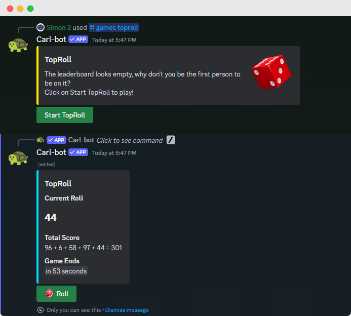
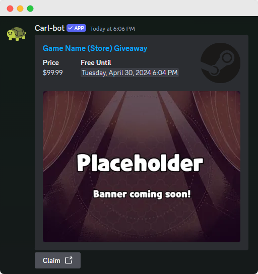
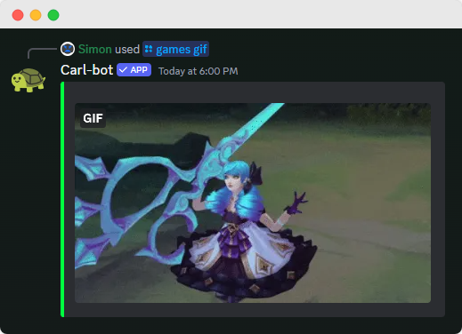

## TopRoll

Start a TopRoll game where users can try to get into the daily leaderboard. Each user tries to roll the highest sum in 6 tries in 60 seconds. The game starts when the first user starts rolling and lasts for a day.

<!-- tabs:start -->

<!-- tab:Slash Commands -->

| Name                  | Example              | Usage                                                 |
| --------------------- | -------------------- | ----------------------------------------------------- |
| **games toproll**     | `/games toproll`     | Starts the TopRoll game.                              |
| **games leaderboard** | `/games leaderboard` | Shows the current TopRoll leaderboard for the server. |

<!-- tab:Mention Commands -->

| Name                  | Example                       | Usage                                                 |
| --------------------- | ----------------------------- | ----------------------------------------------------- |
| **games toproll**     | `@Carl-bot games toproll`     | Starts the TopRoll game.                              |
| **games leaderboard** | `@Carl-bot games leaderboard` | Shows the current TopRoll leaderboard for the server. |

<!-- tabs:end -->

## Free Game Alerts

Get notified whenever there is a free game giveaway. Currently we only support Steam, Origin, Ubisoft, Epic Games Store, Android and GOG.

<!-- tabs:start -->

<!-- tab:Slash Commands -->

| Name                                | Example         | Usage                                           |
| ----------------------------------- | --------------- | ----------------------------------------------- |
| **games alerts** [config] [channel] | `/games alerts` | Get/Set the configuration for free game alerts. |

<!-- tab:Mention Commands -->

| Name                                         | Example                  | Usage                                           |
| -------------------------------------------- | ------------------------ | ----------------------------------------------- |
| **games alerts** [enable\|disable] [channel] | `@Carl-bot games alerts` | Get/Set the configuration for free game alerts. |

<!-- tabs:end -->

## Game GIFs

Sends game related GIFs. Currently we only support League of Legends.

<!-- tabs:start -->

<!-- tab:Slash Commands -->

| Name                                     | Example             | Usage                                                                                                                         |
| ---------------------------------------- | ------------------- | ----------------------------------------------------------------------------------------------------------------------------- |
| **games gif** \<choice> [emotion] [bomb] | `/games gif league` | Sends 1 or upto 5 GIFs (according to bomb) with the specified emotion or random (according to emotion) of the specified game. |

<!-- tab:Mention Commands -->

| Name                     | Example                      | Usage                                                                                    |
| ------------------------ | ---------------------------- | ---------------------------------------------------------------------------------------- |
| **league** [emotion]     | `@Carl-bot league happy`     | Sends a GIF of League of Legends with the specified emotion. Random if left empty.       |
| **leaguebomb** [emotion] | `@Carl-bot leaguebomb happy` | Sends upto 5 GIFs of League of Legends with the specified emotion. Random if left empty. |

<!-- tabs:end -->

## Fortnite

<!-- tabs:start -->

<!-- tab:Slash Commands -->

?> Not available in Slash Commands currently. Please use Mention Commands instead.

<!-- tab:Mention Commands -->

| Name                                         | Example                | Usage                                                                                                          |
| -------------------------------------------- | ---------------------- | -------------------------------------------------------------------------------------------------------------- |
| [**fortnite**\|**fn**] [platform=pc] \<name> | `@Carl-bot fn Dakotaz` | Fetches some Fortnite stats for a specified player. Platform can be `playstation` or `xbox`, defaults to `pc`. |

<!-- tabs:end -->

## World of Warcraft

<!-- tabs:start -->

<!-- tab:Slash Commands -->

?> Some commands are not available in Slash Commands currently or are in a different category altogether. Please use Mention Commands instead.

<!-- tab:Mention Commands -->

| Name                                       | Example                 | Usage                                      |
| ------------------------------------------ | ----------------------- | ------------------------------------------ |
| [**incursion**\|**assault**\|**assaults**] | `@Carl-bot incursion`   | Displays current incursion timers for WoW. |
| [**invasion**\|**invasions**]              | `@Carl-bot invasion`    | Displays current invasion timers for Wow.  |
| **pickmyclass**                            | `@Carl-bot pickmyclass` | Picks a random WoW class.                  |
| **pickmyspec**                             | `@Carl-bot pickmyspec`  | Picks a random WoW spec.                   |
| [**reset**\|**whenisthereset**]            | `@Carl-bot reset`       | Shows how long until WoW resets for EU/NA. |

<!-- tabs:end -->
