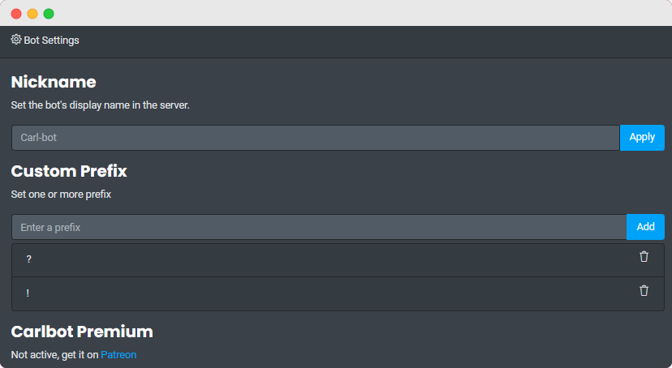
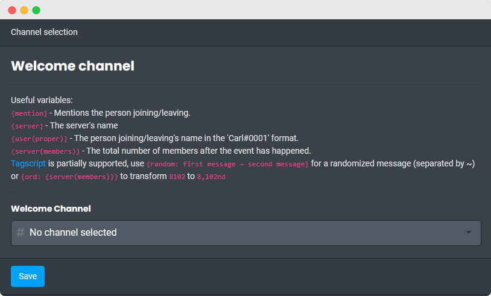

## Navigating

!> Do not literally type out `<` `>` `[` `]` `|` etc.

?> The user permissions required to run certain commands will be mentioned like this.

Each category of commands has their own page which can be found on the sidebar.

| Syntax          | Definition                                                                                     |
| --------------- | ---------------------------------------------------------------------------------------------- |
| `<foo>`         | This argument is mandatory                                                                     |
| `<foos...>`     | This argument is mandatory and you can specify more than one                                   |
| `[foo]`         | This argument is optional                                                                      |
| `[foo='muted']` | This argument is optional and will use the default value **muted** if not specified            |
| `[foo\|bar]`    | This argument is optional so you can either use **foo** or **bar**, or don't specify it at all |
| `[foos...]`     | This argument is optional and you can specify more than one                                    |

Additionally, the bot uses _converters_ which makes specifying roles, members, channels etc, easy and fool-proof. When asked to specify a member, you can provide it a mention, an id, a name or a nickname. This principle works for every single command where applicable.

## Basic Configuration

?> Use the **[Dashboard](https://carl.gg)** to configure the bot easily without the need to use any commands.

This guide will cover everything you need to do to get started with the basics of what carlbot offers.

- ### Prefix

  By default, Carl-bot responds to `/` slash commands. The bot also responds to mention commands, so you can use `@Carl-bot <command>` to run commands. Prefixes other than that are only used for Tags.

- ### Channels
  - **Log Channel**: `/log channel` sets the channel where Carl-bot will log things such as message deletions, name changes, role updates and a lot more which you can find later on in this documentation.
  - **Welcome/Leave Channel**: `/greetings welcome_channel` and `/greetings farewell_channel` set the channels where join/leave alerts will go. More on that later.

- ### Reaction Roles

  Reaction roles work best in their own channels, so Carl-bot offers a command to create a channel specifically for reaction roles with some permissions that most users will find useful. You can create this channel using `/reactionrole channel`. If you are new, it is recommended to use `/reactionrole setup` instead.

- ### Modlogs

  To create a channel where you can see the logs of all moderation actions taken in your server, you can use `/modlog create`. This will create the modlogs channel with appropriate permissions. But if you already have a channel ready for this purpose then you can use `/modlog set ` instead.

- ### Starboard

  To create a starboard use `/starboard setup`. To change the limit of stars required for a post to show up in the starboard use `/starboard limit`.

- ### Logs

  By default, Carl-bot will log everything every member does in every channel. This isn't always what you want so let's say that you don't care about message edits. You can use `/log config [edit]` to stop those from showing up in the logs.
  The `/log config` command takes an event as its argument and tries to figure out what you want toggled. Another thing you can do is ignore logs only in certain channels. For that you can use `/log ignore` to ignore all events from that channel. Logs are very customizable so make sure to head over that section for full information.

- ### Mute Role
  By using `/muterole create` you can create a role with the permission Send Messages denied in every channel. Users can now be muted using `/mute`.

!> Any future channels created will not be covered by Mute Role.

- ### Welcome Message
  You can set the welcome message that would be sent in the previously set [channel](#channels) using `/welcome`. You can also set a different message to be sent in a DM to the member upon joining by using `/joindm`. There are a few variables that can be used in these commands which you can read about in later sections, such as `{user}` for mentioning the user to whom the message is addressed to.

This is far from everything Carl-bot has to offer but at this point you will have set up the crucial things that you can set up.
