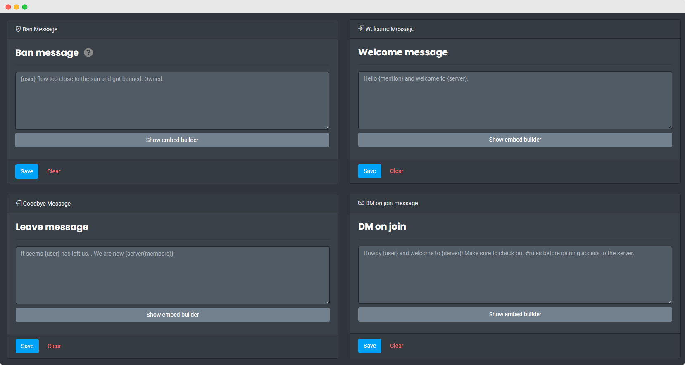
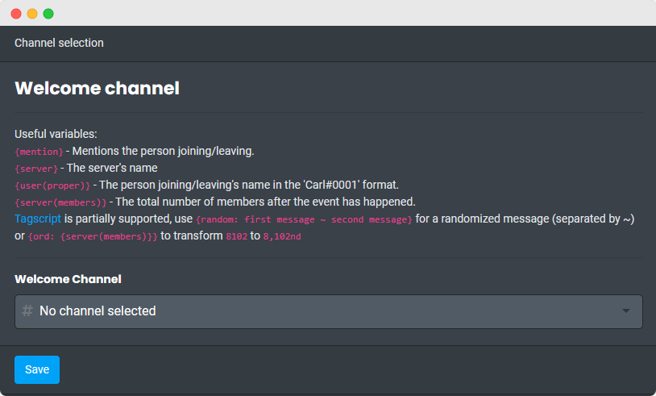

?> We recommend using the [Dashboard](https://carl.gg) as it allows for easier setup and embeds.

### Variables

Supports the following variables:

- `{mention}` - Pings the user
- `{user}` - Name of the user
- `{server}` - Name of the server
- `{user(id)}` - ID of the user
- `{user(proper)}` - Name including the last four digits (Carl-bot#1536)
- `{server(members)}` - Number of members in the server (after the event has happened). Use `{ord:{server(members)}}` to turn 8102 into 8,102nd etc
- `{random: separated ~ by ~ tilde}` - Random string from list. It first checks for `~` as separator and if it's not present, it checks for `,`.
- `{math: 1 + 1}` - Calculate stuff

### Welcome Messages

Carl-bot can send welcome messages to a channel when a user joins the server. You can also DM the user upon joining.

<!-- tabs:start -->

<!-- tab:Prefix Commands -->

| Name                                                                                                            | Example                 | Usage                                                                |
| --------------------------------------------------------------------------------------------------------------- | ----------------------- | -------------------------------------------------------------------- |
| **set welcome** \<channel> Manage Server                               | `!set welcome #welcome` | Sets the channel where welcome notification messages will be posted. |
| [**welcome**\|**greet**] \<text> Manage Server                         | `!welcome Welcome`      | Sets up a welcome message that will be sent when a new user joins.   |
| [**dmjoin**\|**pmjoin**\|**joindm**\|**joinpm**] \<text> Manage Server | `!joindm Welcome`       | DMs the user upon joining your server.                               |

<!-- tab:Slash Commands -->

| Name                                                                                            | Example                               | Usage                                                              |
| ----------------------------------------------------------------------------------------------- | ------------------------------------- | ------------------------------------------------------------------ |
| **greetings welcome_channel** \<channel> Manage Server | `/greetings welcome_channel #welcome` | Sets the channel where welcome messages will be sent.              |
| **greetings welcome** \<message> Manage Server         | `/greetings welcome Welcome`          | Sets up a welcome message that will be sent when a new user joins. |
| **greetings joindm** [message] Manage Server           | `/greetings joindm Welcome`           | DMs the user upon joining your server.                             |

<!-- tabs:end -->

### Leave Messages

Carl-bot can send leave messages to a channel when a user leaves the server.

<!-- tabs:start -->

<!-- tab:Prefix Commands -->

| Name                                                                                     | Example                   | Usage                                                                         |
| ---------------------------------------------------------------------------------------- | ------------------------- | ----------------------------------------------------------------------------- |
| **set farewell** \<channel> Manage Server       | `!set farewell #farewell` | Sets the channel where leave and banmsg notification messages will be posted. |
| [**leave**\|**farewell**] \<text> Manage Server | `!leave Goodbye`          | Sets up a leave message that will be sent when a user leaves the server.      |

<!-- tab:Slash Commands -->

| Name                                                                                             | Example                                 | Usage                                                                    |
| ------------------------------------------------------------------------------------------------ | --------------------------------------- | ------------------------------------------------------------------------ |
| **greetings farewell_channel** \<channel> Manage Server | `/greetings farewell_channel #farewell` | Sets the channel where farewell messages will be sent.                   |
| **greetings farewell** [message] Manage Server          | `/greetings farewell Goodbye`           | Sets up a leave message that will be sent when a user leaves the server. |

<!-- tabs:end -->

### Ban Messages

Ban messages are sent when a user is banned from the server.

<!-- tabs:start -->

<!-- tab:Prefix Commands -->

| Name                                                                      | Example                     | Usage                                                               |
| ------------------------------------------------------------------------- | --------------------------- | ------------------------------------------------------------------- |
| **banmsg** \<text> Manage Server | `!banmsg {user} got banned` | Sets up a banmsg message that will be sent when a user gets banned. |

<!-- tab:Slash Commands -->

| Name                                                                                      | Example                                   | Usage                                                               |
| ----------------------------------------------------------------------------------------- | ----------------------------------------- | ------------------------------------------------------------------- |
| **greetings banmessage** [message] Manage Server | `/greetings banmessage {user} got banned` | Sets up a banmsg message that will be sent when a user gets banned. |

<!-- tabs:end -->

### Testing Messages

To test your welcome, leave and ban messages, you can use the following commands. This will send a welcome, farewell, and ban message to the channel you use this command in.

<!-- tabs:start -->

<!-- tab:Prefix Commands -->

| Name                                                                 | Example      | Usage                                             |
| -------------------------------------------------------------------- | ------------ | ------------------------------------------------- |
| **testgreet** Manage Server | `!testgreet` | Sends a welcome, farewell and banmsg for testing. |

<!-- tab:Slash Commands -->

| Name                                                                           | Example                | Usage                                             |
| ------------------------------------------------------------------------------ | ---------------------- | ------------------------------------------------- |
| **greetings testgreet** Manage Server | `/greetings testgreet` | Sends a welcome, farewell and banmsg for testing. |

<!-- tabs:end -->
