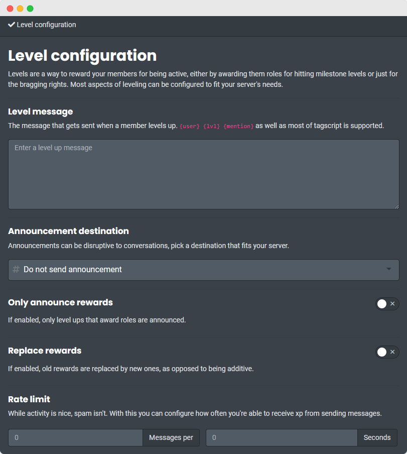
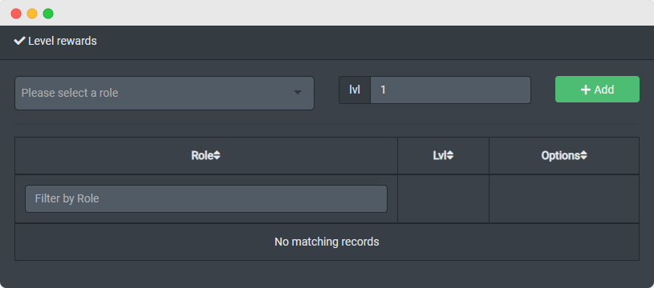

?> Levels is a premium feature offered to our Patrons as a way to show our gratitude for helping keep the bot alive.

## Level Card

!> In order for the bot to start tracking messages you need to change <i>any</i> setting. As long as `level config` command works, the level system works.

<!-- tabs:start -->

<!-- tab:Prefix Commands -->

| Name                                                                                                  | Example                                 | Usage                                                                                                                         |
| ----------------------------------------------------------------------------------------------------- | --------------------------------------- | ----------------------------------------------------------------------------------------------------------------------------- |
| [**levels**\|**lvl**\|**level**\|**lvls**] [member]                                                   | `!level @Carl-bot`                      | Displays the rank card for a member.                                                                                          |
| **level** [background\|bg] \<link\|attachment>                                                        | `!lvl bg https://i.imgur.com/L1n\|<`    | Sets the [background](#background) of your level card.                                                                        |
| **level** [color\|colour] \<color>                                                                    | `!lvl color FF0000`                     | Sets the fill color of the XP bar and the border surrounding your profile picture.                                            |
| **level accent** \<color>                                                                             | `!lvl accent FFFFFF`                    | Sets the color for text, the horizontal bar, and the border surrounding the XP bar.                                           |
| **level** [opacity\|alpha] \<value>                                                                   | `!lvl alpha 0`                          | Sets the opacity of the overlay. 0 - Transparent 1.0 or 100 - Opaque.                                                   |
| **level** [serverbackground\|serverbg] \<link> Manage Server | `!lvl serverbg https://i.ibb.co/L1n\|<` | Sets the default [background](#background) for level cards in your server. This won't overwrite individually set backgrounds. |

<!-- tab:Slash Commands -->

| Name                                                                                                  | Example                             | Usage                                                                                                                         |
| ----------------------------------------------------------------------------------------------------- | ----------------------------------- | ----------------------------------------------------------------------------------------------------------------------------- |
| **level member** [member]                                                                             | `/level member @Carl-bot`           | Displays the rank card for a member.                                                                                          |
| **level background** [link] [attachment]                                                              | `/level background image.png`       | Sets the [background](#background) of your level card.                                                                        |
| **level serverbackground** [link] [attachment] Manage Server | `/level serverbackground image.png` | Sets the default [background](#background) for level cards in your server. This won't overwrite individually set backgrounds. |

<!-- tabs:end -->

### Background

Ideal background resolution is `934x282` pixels but if a different resolution is supplied it will be scaled to the ideal width and cropped to fit the height.

> **Example Level Card:** > 

## Level Settings

<!-- tabs:start -->

<!-- tab:Prefix Commands -->

| Name                                                                                               | Example                     | Usage                                                                                                    |
| -------------------------------------------------------------------------------------------------- | --------------------------- | -------------------------------------------------------------------------------------------------------- |
| **level config** Manage Server                            | `!lvl config`               | Shows the current configuration.                                                                         |
| **level messagexp** [xp] Manage Server                    | `!lvl msgxp 15`             | Sets the amount of XP gained from messages. Resets without a value. Value can be from 15 to 100.         |
| **level addxp** \<xp> \<member> Manage Server             | `!lvl addxp 10 @Carl-bot`   | Adds the specified amount of XP to a user/user ID. Value can be from 1 to 1000.                          |
| **level setlevel** \<level> \<member> Manage Server       | `!lvl setlevel 5 @Carl-bot` | Sets the level of a user/user ID. Value can be from 1 to 100.                                            |
| **level** [blacklist\|bl] <entities...> Manage Server     | `!lvl bl #welcome Muted`    | Blacklists one or more roles and/or channels from gaining xp.                                            |
| **level** [unblacklist\|unbl] <entities...> Manage Server | `!lvl unbl #welcome Muted`  | Removes one or more roles and/or channels from the blacklist.                                            |
| **level mee6import** Manage Server                        | `!lvl mee6import`           | Import exisitng Mee6 config. Carl-bot uses the same XP curve as Mee6. This will replace your current XP. |
| **level rate** [rate] [time] Manage Server                | `!lvl rate 5 60`            | Changes how often you can gain XP.                                                                       |
| **level reset** \<member> Manage Server                   | `!lvl reset @Carl-bot`      | Resets the level and XP of the member. This can't be undone.                                             |
| **level resetall** Manage Server                          | `!lvl resetall`             | Resets the level and XP of the entire server but also creates a backup that you can restore.             |
| **level restore** Manage Server                           | `!lvl restore`              | Restores the level and XP of the entire server from the last backup made.                                |
| **level voicexp**  Manage Server                          | `!lvl voicexp`              | Toggles voice channel XP gain on or off.                                                                 |

<!-- tab:Slash Commands -->

| Name                                                                                                           | Example                               | Usage                                                                                                                                                                                                                                                                                            |
| -------------------------------------------------------------------------------------------------------------- | ------------------------------------- | ------------------------------------------------------------------------------------------------------------------------------------------------------------------------------------------------------------------------------------------------------------------------------------------------ |
| **level config** [choice] [value] Manage Server                       | `/level config`                       | Shows the current configuration. Selecting a choice and value lets you edit the color, opacity and accent of your level card. Color is the color of the XP bar, accent changes the color of the text and opacity changes the transparency of the overlay (1.0 to 100.0 with 100.0 being opaque). |
| **level set_message_xp** \<choice> [xp] Manage Server                 | `/level set_message_xp set 15`        | Sets the amount of XP gained from messages. Value can be from 15 to 100.                                                                                                                                                                                                                         |
| **level add_xp** \<xp> \<member> Manage Server                        | `/level add_xp 10 @Carl-bot`          | Adds the specified amount of XP to a user/user ID. Value can be from 1 to 1000.                                                                                                                                                                                                                  |
| **level set_level** \<level> \<member> Manage Server                  | `/level set_level 5 @Carl-bot`        | Sets the level of a user/user ID. Value can be from 1 to 100.                                                                                                                                                                                                                                    |
| **level blacklist** Manage Server \<add\|remove> \<channels_or_roles> | `/level blacklist add #welcome Muted` | Adds or removes roles and/or channels to/from the blacklist.                                                                                                                                                                                                                                     |
| **level mee6import** Manage Server                                    | `/level mee6import`                   | Import exisitng Mee6 config. Carl-bot uses the same XP curve as Mee6. This will replace your current XP.                                                                                                                                                                                         |
| **level rate** [rate] Manage Server                                   | `/level rate 5 60`                    | Changes how often you can gain XP.                                                                                                                                                                                                                                                               |
| **level reset** \<choice> [user_id] Manage Server                     | `/level reset all`                    | Resets the level and XP of the member or the entire server.                                                                                                                                                                                                                                      |
| **level restore** Manage Server                                       | `/level restore`                      | Restores the level and XP of the entire server from the last backup made.                                                                                                                                                                                                                        |
| **level voice_xp**  Manage Server                                     | `/level voice_xp`                     | Toggles voice channel XP gain on or off.                                                                                                                                                                                                                                                         |

<!-- tabs:end -->

## Level Notifications

<!-- tabs:start -->

<!-- tab:Prefix Commands -->

| Name                                                                                       | Example                  | Usage                                                              |
| ------------------------------------------------------------------------------------------ | ------------------------ | ------------------------------------------------------------------ |
| **level shh** Manage Server                       | `!lvl shh`               | Bot stops announcing level up messages.                            |
| **level dm** Manage Server                        | `!lvl dm`                | Makes the bot DM the level up message to the user.                 |
| **level channel** [channel=current] Manage Server | `!lvl channel #level-up` | Sets a channel to send level up messages to.                       |
| **level limit** \<number> Manage Server           | `!lvl limit 15`          | Only announce level ups above the limit.                           |
| **level mod** \<number> Manage Server             | `!lvl mod 5`             | Only announce level ups if they are evenly divisble by the number. |
| **level rewardonly** Manage Server                | `!lvl rewardonly`        | Only announce level ups with associated rank rewards.              |
| **leaderboard** [page]                                                                     | `!leaderboard`           | Lists the members based on their XP.                               |
| **level log** Manage Server                       | `!lvl log`               | Shows the last 25 level ups in the server.                         |

<!-- tab:Slash Commands -->

| Name                                                                                         | Example                        | Usage                                                                                                           |
| -------------------------------------------------------------------------------------------- | ------------------------------ | --------------------------------------------------------------------------------------------------------------- |
| **level message** \<choice> [message] Manage Server | `/level message set Congrats!` | Sets or resets the level up message.                                                                            |
| **level toggle** \<choice> Manage Server            | `/level toggle dm`             | Toggles the DM setting for level up messages or the toggle for newer rewards replacing earlier level up rewards |
| **level channel** [channel=current] Manage Server   | `/level channel #level-up`     | Sets a channel to send level up messages to.                                                                    |
| **level limit** \<limit> Manage Server              | `/level limit 15`              | Only announce level ups above the limit.                                                                        |
| **level mod** \<mod> Manage Server                  | `/level mod 5`                 | Only announce level ups if they are evenly divisble by the number.                                              |
| **level rewardonly** Manage Server                  | `/level rewardonly`            | Only announce level ups with associated rank rewards.                                                           |
| **leaderboard** [page]                                                                       | `/level leaderboard`           | Lists the members based on their XP.                                                                            |
| **level log** Manage Server                         | `/level log`                   | Shows the last 25 level ups in the server.                                                                      |

<!-- tabs:end -->

## Level Rewards

<!-- tabs:start -->

<!-- tab:Prefix Commands -->

| Name                                                                                  | Example                 | Usage                                                                                                    |
| ------------------------------------------------------------------------------------- | ----------------------- | -------------------------------------------------------------------------------------------------------- |
| **level replace** Manage Server              | `!lvl replace`          | Toggles between rewards being additive or replacing earlier rewards.                                     |
| **level reward** \<lvl> [role] Manage Server | `!lvl reward 10 Member` | Adds a reward for the specified level. Use without specifying a role to remove the reward at that level. |

<!-- tab:Slash Commands -->

| Name                                                                                    | Example                   | Usage                                                                                                    |
| --------------------------------------------------------------------------------------- | ------------------------- | -------------------------------------------------------------------------------------------------------- |
| **level reward** \<level> [role] Manage Server | `/level reward 10 Member` | Adds a reward for the specified level. Use without specifying a role to remove the reward at that level. |

<!-- tabs:end -->
