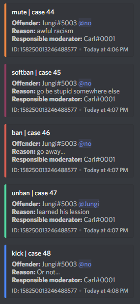

# Modlogs

| Name | Example | Usage |
| :--- | :--- | :--- |
| **modlog create [name='modlog']** | !modlog create auditlog | Creates a modlog where moderation actions will be logged. |
| **modlog set &lt;#channel&gt;** | !modlog set #modlog | Sets an already existing channel to send actions to (make sure the bot has the permissions required to post in the channel) |
| **modlog clear** | !modlog clear | Makes the bot stop logging actions to the channel |
| **modlog from &lt;@member/ID&gt;** | !modlog from @Carl#0001 | Retrieves all infractions for a member with the responsible moderator. |
| **reason &lt;case\_id&gt;** | !reason 17 Spamming nazi imagery | Sets a reason for a modlog entry, useful for cases where you either banned manually or forgot to specify a reason |
| **modlog highscores** | !modlog highscores | Shows the moderators ranked by how many actions they've taken. |
| **modlog export [member/ID]** | !modlog export @Carl#0001 | Generates a `.txt` file of your server's modlogs or the modlogs relating to the user specified. |

Useful for transparency and organizing

