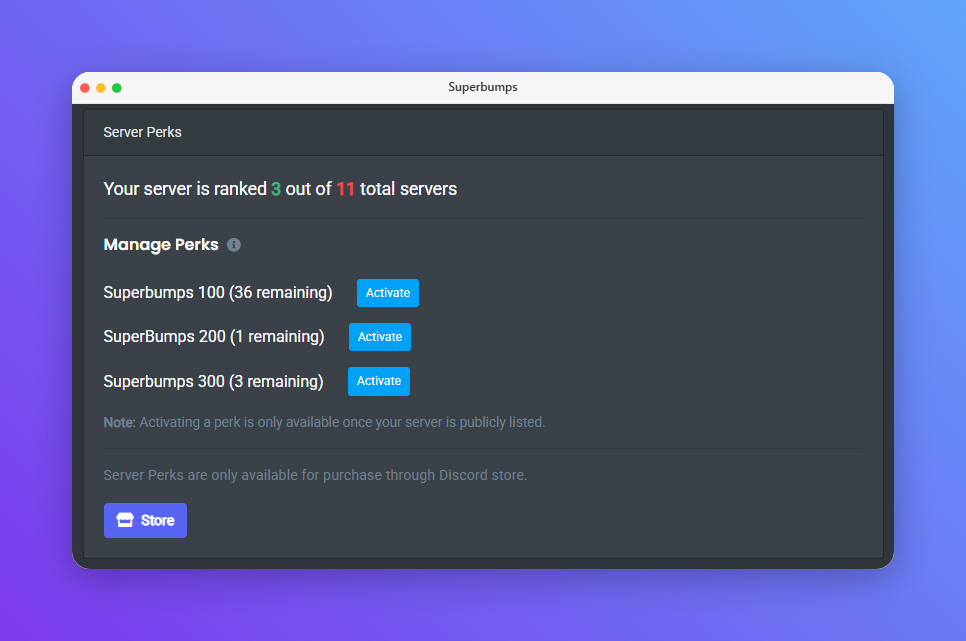

Perks are a set of features that are available to users through the bot's **[Discord Store](https://discord.com/discovery/applications/235148962103951360/store)**. You can manage your perks through the following commands or through the **[Dashboard](https://carl.gg)** in the **Server Discovery** section.

## Superbumps

**Superbumps** are temporary perks that increase your server's bump count for 30 days, helping improve its visibility in Server Discovery. Available in multiple tiers, each Superbump pack grants a fixed number of bonus bumps that remain active for the duration. You can activate purchased Superbumps at any time using the `/perks superbumps` command or from your server's dashboard.

<!-- tabs:start -->

<!-- tab:Prefix Commands -->

| Name                       | Example       | Usage                                              |
| -------------------------- | ------------- | -------------------------------------------------- |
| **superbumps**\|**sbumps** | `!superbumps` | Activate a Superbumps pack for the current server. |

<!-- tab:Slash Commands -->

| Name                 | Example             | Usage                                              |
| -------------------- | ------------------- | -------------------------------------------------- |
| **perks superbumps** | `/perks superbumps` | Activate a Superbumps pack for the current server. |

<!-- tabs:end -->
