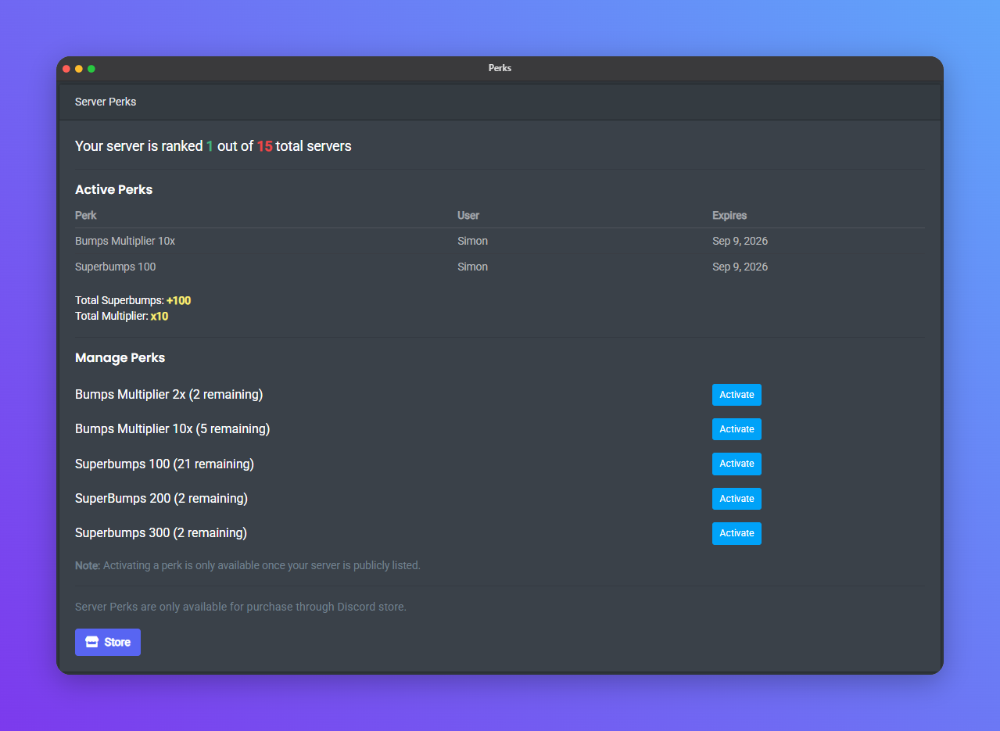

Perks are a set of features that are available to users through the bot's **[Discord Store](https://discord.com/discovery/applications/235148962103951360/store)**. You can manage your perks through the following commands or through the **[Dashboard](https://carl.gg)** in the **Server Discovery** section.

## Superbumps

**Superbumps** are temporary perks that increase your server's bump count for 30 days, helping improve its visibility in Server Discovery. Available in multiple tiers, each Superbump pack grants a fixed number of bonus bumps that remain active for the duration. You can activate purchased Superbumps at any time using the `/perks superbumps` command or from your server's dashboard.

## Bumps Multiplier

**Bump Multipliers** are 30-day perks that multiply every user `/bump` your server receives, helping you earn more bumps and increase your server's visibility in Server Discovery.

## Commands

<!-- tabs:start -->

<!-- tab:Prefix Commands -->

| Name                      | Example       | Usage                                                |
| ------------------------- | ------------- | ---------------------------------------------------- |
| **bumps**\|**superbumps** | `!superbumps` | View and activate perk packs for the current server. |

<!-- tab:Slash Commands -->

| Name            | Example        | Usage                                                |
| --------------- | -------------- | ---------------------------------------------------- |
| **perks bumps** | `/perks bumps` | View and activate perk packs for the current server. |

<!-- tabs:end -->
