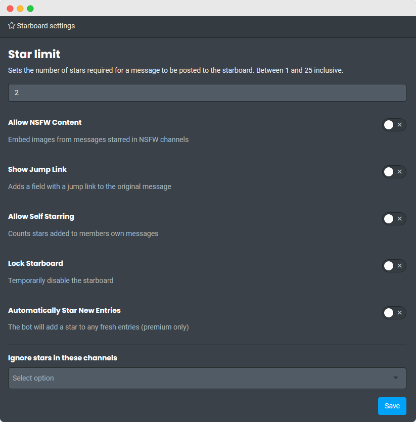

?> After you make a Starboard channel, your members can react to any message with a ⭐ `:star:` which counts as a vote to display that message as a post on the Starboard. Once the message gets enough reactions, Carl-bot posts it onto the Starboard. By default, a user's reaction on their own post doesn't count.

<!-- tabs:start -->

<!-- tab:Prefix Commands -->

| Name                                                                                     | Example                    | Usage                                                                                                |
| ---------------------------------------------------------------------------------------- | -------------------------- | ---------------------------------------------------------------------------------------------------- |
| **starboard** [channel=starboard] Manage Server | `!starboard #stars`        | Sets up the Starboard for the server. Defaults to creating new channel named `#starboard`.           |
| **star limit** \<number> Manage Server          | `!star limit 3`            | Sets the amount of reactions required for a post to get posted on the Starboard.                     |
| **star nsfw** Manage Server                     | `!star nsfw`               | Toggles stars in NSFW channels.                                                                      |
| **star self** Manage Server                     | `!star self`               | Toggles being able to star your own posts.                                                           |
| **star** [server\|stats\|top] [member]                                                   | `!star stats @Carl-bot`    | Shows some information about the server's or specified member's starred posts and giving pattern.    |
| **star show** \<message_id>                                                              | `!star show 123456`        | Shows a starred post from the Starboard in the channel the command was used in.                      |
| **star** [jump\|source] Manage Server           | `!star jump`               | Sends the direct link to the starred message.                                                        |
| **star autostar** Manage Server                 | `!star autostar`           | This is a [Premium](https://carl.gg/get-premium) command. Automatically stars new Starboard entries. |
| **star blacklist** \<channels> Manage Server    | `!star blacklist #staff`   | Blocks channels from having their messages starred.                                                  |
| **star unblacklist** \<channels> Manage Server  | `!star unblacklist #staff` | Unblocks channels from having their messages starred.                                                |
| **star config** Manage Server                   | `!star config`             | View Starboard configuration for server.                                                             |
| **star lock** Manage Server                     | `!star lock`               | Locks the Starboard making it completely uninteractive.                                              |
| **star random**                                                                          | `!star random`             | Shows a random starred message.                                                                      |
| **star remove** Manage Server                   | `!star remove`             | Removes a channel as starboard.                                                                      |
| **star emoji** [emoji] Manage Server            | `!star emoji 🔥`           | Sets or resets an emoji for starboard. This is a [Premium](https://carl.gg/get-premium) command.     |

<!-- tab:Slash Commands -->

| Name                                                                                       | Example                     | Usage                                                                                                |
| ------------------------------------------------------------------------------------------ | --------------------------- | ---------------------------------------------------------------------------------------------------- |
| **stars setup** [channel=starboard] Manage Server | `/stars setup #stars`       | Sets up the Starboard for the server. Defaults to creating new channel named `#starboard`.           |
| **stars limit** \<limit> Manage Server            | `/stars limit 3`            | Sets the amount of reactions required for a post to get posted on the Starboard.                     |
| **stars nsfw** Manage Server                      | `/stars nsfw`               | Toggles embedding images from starred messages in NSFW channels.                                     |
| **stars self** Manage Server                      | `/stars self`               | Toggles being able to star your own posts.                                                           |
| **stars server**                                                                           | `/stars server`             | Displays stats about the server's starboard.                                                         |
| **stars stats** [member]                                                                   | `/stars stats @Carl-bot`    | Shows some information about the server's or specified member's starred posts and giving pattern.    |
| **stars show** \<message_id>                                                               | `/stars show 123456`        | Shows a starred post from the Starboard in the channel the command was used in.                      |
| **stars jump** Manage Server                      | `/stars jump`               | Sends the direct link to the starred message.                                                        |
| **stars autostar** Manage Server                  | `/stars autostar`           | This is a [Premium](https://carl.gg/get-premium) command. Automatically stars new Starboard entries. |
| **stars blacklist** \<channels> Manage Server     | `/stars blacklist #staff`   | Blocks channels from having their messages starred.                                                  |
| **stars unblacklist** \<channels> Manage Server   | `/stars unblacklist #staff` | Unblocks channels from having their messages starred.                                                |
| **stars config** Manage Server                    | `/stars config`             | View Starboard configuration for server.                                                             |
| **stars lock** Manage Server                      | `/stars lock`               | Locks the Starboard making it completely uninteractive.                                              |
| **stars random**                                                                           | `/stars random`             | Shows a random starred message.                                                                      |
| **stars remove** Manage Server                    | `/stars remove`             | Removes a channel as starboard.                                                                      |
| **stars emoji** \<choice> [emoji] Manage Server   | `/stars emoji set 🔥`       | Sets or resets an emoji for starboard. This is a [Premium](https://carl.gg/get-premium) command.     |

<!-- tabs:end -->
