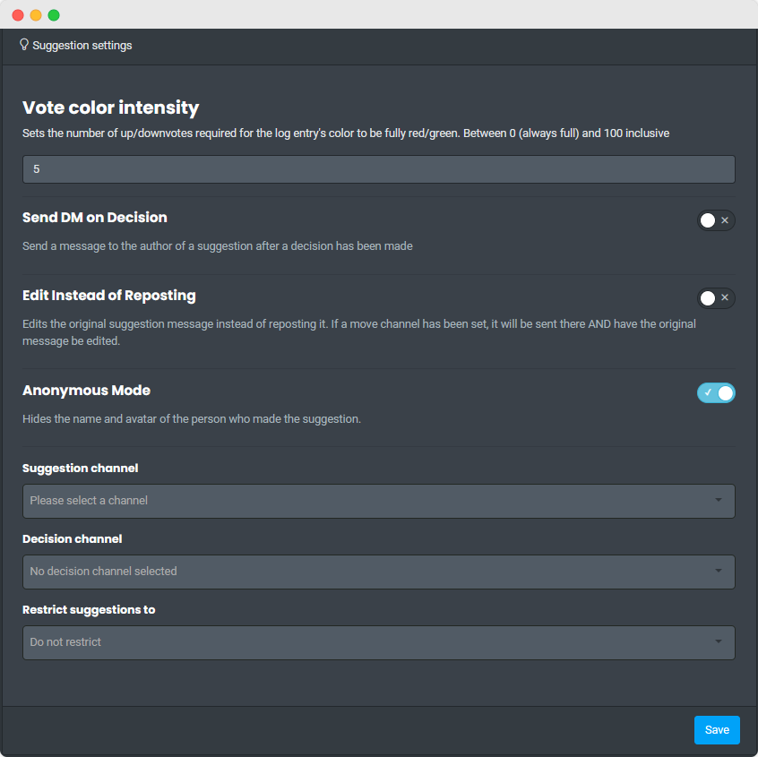

?> All commands here require `suggestion channel` to have been used and set in order to work.

## Settings

<!-- tabs:start -->

<!-- tab:Slash Commands -->

| Name                                                                                                | Example                           | Usage                                                                                            |
| --------------------------------------------------------------------------------------------------- | --------------------------------- | ------------------------------------------------------------------------------------------------ |
| **suggestion server** Manage Server                        | `/suggestion server`              | Displays the server's current suggestion config.                                                 |
| **suggestion channel** [channel=suggestions] Manage Server | `/suggestion channel`             | Sets a channel as the suggestions channel or creates a new one named `suggestions`.              |
| **suggestion dm** Manage Server                            | `/suggestion dm`                  | Toggles between sending the person who suggested something upon a moderator deciding on it.      |
| **suggestion limit** \<limit> Manage Server                | `/suggestion limit 5`             | The amount of votes difference required to change the embed color to red/green.                  |
| **suggestion move** [channel=suggestion-log] Manage Server | `/suggestion move`                | Set a secondary channel to announce approved/denied suggestions.                                 |
| **suggestion edit** Manage Server                          | `/suggestion edit`                | Toggles if orginal suggestion should be edited to show the decision made.                        |
| **suggestion submit** [channel] Manage Server              | `/suggestion submit #submissions` | Sets a single channel where members are allowed to make suggestions.                             |
| **suggestion anonymous** Manage Server                     | `/suggestion anonymous`           | Toggles member's name and avatar to show/not show in their suggestions. This is not retroactive. |
| **suggestion who** \<suggestion_id> Manage Server          | `/suggestion who 6`               | Shows who suggested a suggestion.                                                                |

<!-- tab:Mention Commands -->

| Name                                                                                                | Example                                    | Usage                                                                                            |
| --------------------------------------------------------------------------------------------------- | ------------------------------------------ | ------------------------------------------------------------------------------------------------ |
| [**suggestion**\|**suggestions**] Manage Server            | `@Carl-bot suggestion`                     | Displays the server's current suggestion config.                                                 |
| **suggestion channel** [channel=suggestions] Manage Server | `@Carl-bot suggestion channel`             | Sets a channel as the suggestions channel or creates a new one named `suggestions`.              |
| **suggestion dm** Manage Server                            | `@Carl-bot suggestion dm`                  | Toggles between sending the person who suggested something upon a moderator deciding on it.      |
| **suggestion limit** \<number> Manage Server               | `@Carl-bot suggestion limit 5`             | The amount of votes difference required to change the embed color to red/green.                  |
| **suggestion move** [channel=suggestion-log] Manage Server | `@Carl-bot suggestion move`                | Set a secondary channel to announce approved/denied suggestions.                                 |
| **suggestion edit** Manage Server                          | `@Carl-bot suggestion edit`                | Toggles if orginal suggestion should be edited to show the decision made.                        |
| **suggestion submit** [channel] Manage Server              | `@Carl-bot suggestion submit #submissions` | Sets a single channel where members are allowed to make suggestions.                             |
| **suggestion anon** Manage Server                          | `@Carl-bot suggestion anon`                | Toggles member's name and avatar to show/not show in their suggestions. This is not retroactive. |
| **suggestion who** \<suggestion_id> Manage Server          | `@Carl-bot suggestion who 6`               | Shows who suggested a suggestion.                                                                |

<!-- tabs:end -->

## Making Suggestions

<!-- tabs:start -->
<!-- tab:Slash Commands -->

Anyone can use the `suggestion suggest` command to make suggestions.

| Name                              | Example                       | Usage                 |
| --------------------------------- | ----------------------------- | --------------------- |
| **suggestion suggest** \<content> | `/suggestion suggest make vc` | Creates a suggestion. |

<!-- tab:Mention Commands -->

Anyone can use the `suggest` command to make suggestions.

| Name                   | Example                     | Usage                 |
| ---------------------- | --------------------------- | --------------------- |
| **suggest** \<message> | `@Carl-bot suggest make vc` | Creates a suggestion. |

<!-- tabs:end -->

## Suggestion Decisions

<!-- tabs:start -->

<!-- tab:Slash Commands -->

| Name                                                                                                       | Example                           | Usage                                   |
| ---------------------------------------------------------------------------------------------------------- | --------------------------------- | --------------------------------------- |
| **suggestion approve** \<suggestionid> [reason] Manage Server     | `/suggestion approve 3`           | Approves a suggestion.                  |
| **suggestion deny** \<suggestionid> [reason] Manage Server        | `/suggestion deny 4 spam`         | Denies a suggestion.                    |
| **suggestion consider** \<suggestionid> [reason] Manage Server    | `/suggestion consider 5`          | Marks a suggestion as being considered. |
| **suggestion implemented** \<suggestionid> [reason] Manage Server | `/suggestion implemented 1 Added` | Marks a suggestion as implemented.      |

<!-- tab:Mention Commands -->

| Name                                                                                             | Example                         | Usage                                   |
| ------------------------------------------------------------------------------------------------ | ------------------------------- | --------------------------------------- |
| **approve** \<suggestion_id> [reason] Manage Server     | `@Carl-bot approve 3`           | Approves a suggestion.                  |
| **deny** \<suggestion_id> [reason] Manage Server        | `@Carl-bot deny 4 spam`         | Denies a suggestion.                    |
| **consider** \<suggestion_id> [reason] Manage Server    | `@Carl-bot consider 5`          | Marks a suggestion as being considered. |
| **implemented** \<suggestion_id> [reason] Manage Server | `@Carl-bot implemented 1 Added` | Marks a suggestion as implemented.      |

<!-- tabs:end -->
