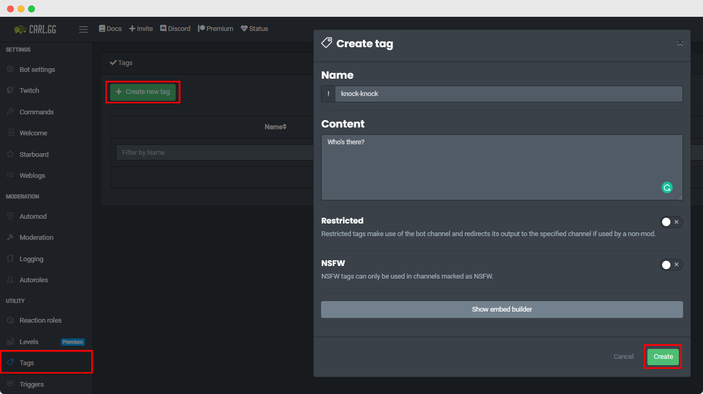
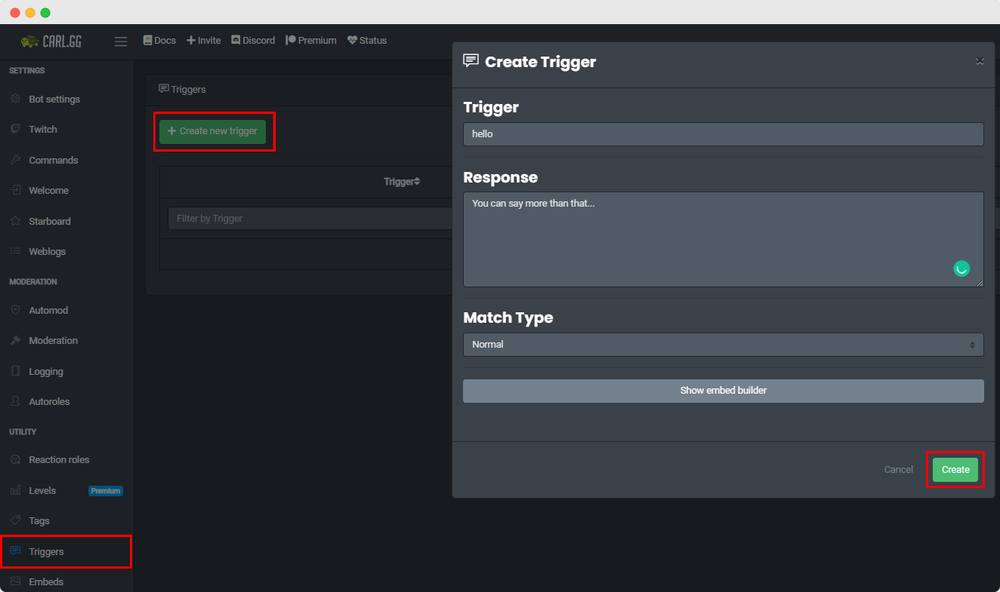

## Tags
Tags are basically custom commands that can be called using their names after Carl-bot's prefix. So, if you have created a tag named **test** which has the content `Hello World` then you can use `!test` to make the bot reply `Hello World`.

?> Tags can get complicated, check out [Advanced Usage](#advanced-usage) for a more thorough explanation of Tagscript.

### Tag Commands

<!-- tabs:start -->

<!-- tab:Prefix Commands -->
Name              | Example           | Usage                                                                         
 ---------------- | ----------------- | ----------------------------------------------------------------------------- 
**tag** [create\|add\|+] \<name> \<content> | `!tag + test hello` | Creates a tag/custom command. Commands can then be used with just the prefix.
**tag** [delete\|del\|remove\|-] \<name> | `!tag - test` | Removes a tag.                                             
**tag ++** \<name> \<pastebin_link> | `!tag ++ test https://pastebin.com/1234` | Use this command for creating tags whose content length is more than 2000 characters, using Pastebin.
**tag** [+=\|append] \<name> \<content> | `!tag += test world` | Appends content to an already existing tag.          
**tag** [a\|alias] \<new> \<existing> | `!tag alias testing test` | Creates an alias for an already existing tag so you can call it with either of the names. Changes to the existing tag will update its aliases. |
**tag raw** \<name> | `!tag raw test` | Retrieves a tag with its markdown (bold, italic, tagscript etc.) removed.     
**tag edit** \<name> \<content> | `!tag edit test bye world` | Edits the content of an already existing tag.          
**tag nsfw** \<name> | `!tag nsfw test` | Restricts the tag so that it can only be used in channels marked as NSFW.
**tag restrict** \<name> | `!tag restrict test` | This will make the bot post the content in the bot-channel and ping the author upon being used.
**tag stats** [member] | `!tag stats @Carl-bot` | Shows information about the server tags (uses, top 3, total number of tags). If you mention someone, it will show their tags instead.
**tag info** \<name> | `!tag info test` | Shows some stats collected about the tag, uses, creation date, last update, owner, etc.
**tag ownership** [enable\|disable] | `!tag ownership enable` | With this enabled (disabled by default) tags are 'owned' meaning that unless you're a mod, you can't edit, append or delete other people's tags. You can still create aliases to people's tags.
**tag modonly** [enable\|disable] Manage Server | `!tag modonly enable` | With this enabled, only mods can manage tags, non-mods can still use them.
**tag prompt** | `!tag prompt` | With this disabled (enabled by default), it will default to editing the tag when you try to create an already existing tag.
**tag claim** \<name> | `!tag claim test` | Claims a tag from a member who has left the server, only relevant if ownership is enabled.
**tag sub** \<name> \<from_text> \<to_text> | `!tag sub test world universe` | Replaces every occurance of `from_text` with `to_text` in an already existing tag.
[**commands**\|**taglist**] | `!taglist` | Lists all of the tags on the server.                                           
**tag share** \<name> | `!tag share test` | Creates a shareable link of a tag so that other users can import it to their servers.
**tag unshare** \<name> Manage Server | `!tag unshare picross` | Unshare a specific publicly shared tag. Already created share link will not work once you unshare a tag.
**tag unshareall** Manage Server | `!tag unshareall` | Unshare all publicly shared tags.

<!-- tab:Slash Commands -->
Name              | Example           | Usage                                                                        
 ---------------- | ----------------- | -----------------------------------------------------------------------------
**tag create** \<name> \<content> | `/tag create test hello` | Creates a tag/custom command. Commands can then be used with just the prefix.
**tag remove** \<name> | `/tag remove test` | Removes a tag.                                                          
**tag procreate** \<name> \<content> | `/tag procreate test https://pastebin.com/1234` | Use this command for creating tags whose content length is more than 2000 characters, using Pastebin.
**tag append** \<name> \<content> | `/tag append test world` | Appends content to an already existing tag.            
**tag alias** \<point> \<name> | `/tag alias testing test` | Creates an alias for an already existing tag so you can call it with either of the names. Changes to the existing tag will update its aliases.
**tag raw** \<name> | `/tag raw test` | Retrieves a tag with its markdown (bold, italic, tagscript etc.) removed.     
**tag edit** \<name> \<content> | `/tag edit test bye world` | Edits the content of an already existing tag.          
**tag nsfw** \<name> | `/tag nsfw test` | Restricts the tag so that it can only be used in channels marked as NSFW.   
**tag restrict** \<name> | `/tag restrict test` | This will make the bot post the content in the bot-channel and ping the author upon being used.
**tag stats** [member] | `/tag stats @Carl-bot` | Shows information about the server tags (uses, top 3, total number of tags). If you mention someone, it will show their tags instead.
**tag info** \<name> | `/tag info test` | Shows some stats collected about the tag, uses, creation date, last update, owner, etc.
**tag ownership** \<status> | `/tag ownership enable` | With this enabled (disabled by default) tags are 'owned' meaning that unless you're a mod, you can't edit, append or delete other people's tags. You can still create aliases to people's tags.
**tag modonly** \<status> Manage Server | `/tag modonly enable` | With this enabled, only mods can manage tags, non-mods can still use them.
**tag claim** \<name> | `/tag claim test` | Claims a tag from a member who has left the server, only relevant if ownership is enabled.
**tag replace** \<name> \<from_text> \<to_text> | `/tag replace test world universe` | Replaces every occurance of `from_text` with `to_text` in an already existing tag.
**tag list** [member] | `/tag list` | Lists all of the tags on the server or by a specific member.                   
**tag share** \<name> | `/tag share test` | Creates a shareable link of a tag so that other users can import it to their servers.
**tag unshare** \<name> Manage Server | `/tag unshare picross` | Unshare a specific publicly shared tag. Already created share link will not work once you unshare a tag.
**tag unshareall** Manage Server | `/tag unshareall` | Unshare all publicly shared tags.

<!-- tabs:end -->

#### Importing Tags
You can easily import a tag's share link. After navigating to the link, find the server selection dropdown menu in the lower right-hand corner, select your server and then click **Import**.

### Popular Tags

Some of the more clever and technical tags are showcased here.

Want your creation featured here? Post it in the `#show-off` channel of the [Support Server](https://discord.gg/S2ZkBTnd8X) and be a little lucky. We value creativity and novel solutions more than advanced tagscript usage.

<!-- tabs:start -->

<!-- tab:Server Tags -->
Tag Name          | Description                                                               | Author            | Import Link                                   
 ---------------- | ------------------------------------------------------------------------- | ----------------- | --------------------------------------------- 
**>**	          | A quote tag made to work with Discord's quote system.                     | Raffael	          | [carl.gg/t/107229](https://carl.gg/t/107229)   
**afk**	          | Creates/deletes triggers that fire when you are mentioned.	          | Raffael	          | [carl.gg/t/41176](https://carl.gg/t/41176)     
**colors**        | Assists in creating a basic color roles menu.	                          | Vince the Animator| [carl.gg/t/107305](https://carl.gg/t/107305)  
**getid**	      | A tag that retrieves the ID of any specified channel, emoji or user.	  | Asty'	          | [carl.gg/t/120698](https://carl.gg/t/120698)   
**goal**	      | Create and track membercount milestones.	                              | deniiiii 🦕	     | [carl.gg/t/170717](https://carl.gg/t/170717)   
**promote**       | Set up RP promotions that follow a chain of command.	                  | Raffael	          | [carl.gg/t/86149](https://carl.gg/t/86149)     
**rules**	      | A complex rules listing tag.	                                          | Raffael	          | [carl.gg/t/81906](https://carl.gg/t/81906)     
**setup**	      | A tag that helps with the initial server setup.	                          | Raffael	          | [carl.gg/t/239346](https://carl.gg/t/239346)   
**social**        | Dynamic Per-User Social Media Clickable Icons.                            | Asty'	          | [carl.gg/t/254647](https://carl.gg/t/254647)   
**submit**        | An image submission tag. Rename the channel in the redirect for this to work. | Antimony	  | [carl.gg/t/32150](https://carl.gg/t/32150)     
**verify**        | Custom Captcha Verification system.	                                      | Tush	          | [carl.gg/t/107546](https://carl.gg/t/107546)   

<!-- tab:Utility Tags -->
Tag Name          | Description                                                               | Author            | Import Link                                   
 ---------------- | ------------------------------------------------------------------------- | ----------------- | --------------------------------------------- 
**changetemp**	  | A temperature conversion tag.	                                          | Rath.	          | [carl.gg/t/110423](https://carl.gg/t/110423)
**color**	      | Displays information about a color your input or a random color. Accepts multiple input formats. | Elise | [carl.gg/t/183918](https://carl.gg/t/183918) 
**colortext**	  | Outputs your text colorized in a codeblock.	                              | Raffael	          | [carl.gg/t/98660](https://carl.gg/t/98660)    
**define**	      | Outputs the URL to the Merriam-Webster page for the word or phrase that follows the tag. Link preview displays definition. | Raffael | [carl.gg/t/44427](https://carl.gg/t/44427)
**formatting**	  | Shows all of the Markdown formatting you can do in Discord.	              | ent3r_	          | [carl.gg/t/240243](https://carl.gg/t/240243)
<!-- **weather**	      | Displays current weather for a location. Usage: `weather <location>`	  | Near	          | [carl.gg/t/208597](https://carl.gg/t/208597) -->

<!-- tab:Game Tags -->
Tag Name          | Description                                                               | Author            | Import Link                                   
 ---------------- | ------------------------------------------------------------------------- | ----------------- | --------------------------------------------- 
**corruption**    | Shows the sales turnover of the corruption vendor in WoW.                 | Nerog             | [carl.gg/t/230662](https://carl.gg/t/230662)  
**owi**           | An Overwatch information tag.                                             | Raffael           | [carl.gg/t/45738](https://carl.gg/t/45738)    
**pubg**          | PUBG Mobile information tag.                                              | Raffael & Gucci Potato | [carl.gg/t/250958](https://carl.gg/t/250958)
**5carddraw**     | A 5 card draw game for you and a friend you mention.	                  | Raffael	          | [carl.gg/t/72591](https://carl.gg/t/72591)    
**battle**        | A Pokémon style arena battle.	                                          | RedAngel	      | [carl.gg/t/31280](https://carl.gg/t/31280)    
**cgol**          | Conway's game of life.                                                    | Dungo	          | [carl.gg/t/41017](https://carl.gg/t/41017)    
**connect4**      | Play a game of Connect Four using Carl-bot.	                              | Dungo	          | [carl.gg/t/51924](https://carl.gg/t/51924)    
**hunt**          | Play Duckhunt with a tag.	                                              | dreny	          | [carl.gg/t/31757](https://carl.gg/t/31757)
**lightsout**     | A lights out game implementation as a tag.	                              | Garfield	      | [carl.gg/t/34826](https://carl.gg/t/34826)    
**maze**          | A Maze Generator tag.	                                                  | Raffael	          | [carl.gg/t/260353](https://carl.gg/t/260353)
**mine**          | Play Minesweeper with a tag.	                                          | Dungo	          | [carl.gg/t/35755](https://carl.gg/t/35755)  
**picross**       | The game Picross as a tag.	                                              | Dungo	          | [carl.gg/t/38184](https://carl.gg/t/38184)    
**race**          | Race different vehicles against opponents.	                              | ! SpinaChant      | [carl.gg/t/226914](https://carl.gg/t/226914)  
**slots**         | A slots tag using emojis.	                                              | Raffael & RedAngel| [carl.gg/t/96789](https://carl.gg/t/96789)
**slots**         | A slots tag using GIFs.	                                                  | Rath.	          | [carl.gg/t/206215](https://carl.gg/t/206215)  
**tictactoe**     | A Tic-Tac-Toe game. Do: `tictactoe new` to start.	                      | Tush	          | [carl.gg/t/98106](https://carl.gg/t/98106)
**whodoneit**     | A who-done-it minigame.	                                                  | Deviation	      | [carl.gg/t/34022](https://carl.gg/t/34022)    

<!-- tab:Conversation -->
Tag Name          | Description                                                               | Author            | Import Link                                   
 ---------------- | ------------------------------------------------------------------------- | ----------------- | --------------------------------------------- 
**qotd**          | Displays a random quote of the day.                                       | freya ☆          | [carl.gg/t/85193](https://carl.gg/t/85193)    
**topic**         | A random chat topic generator, to spur conversation.                      | Shaun             | [carl.gg/t/76685](https://carl.gg/t/76685)    

<!-- tab:Time Based -->
Tag Name          | Description                                                               | Author            | Import Link                                   
 ---------------- | ------------------------------------------------------------------------- | ----------------- | --------------------------------------------- 
**calendar**	    | Outputs a month-view calendar for the current month or month you specify. Usage: `calendar 2019 1` would display Jan 2019. | Tush | [carl.gg/t/101740](https://carl.gg/t/101740)
**holidaycd**	    | A configurable Holiday countdown tag.	                                    | Raffael	        | [carl.gg/t/84778](https://carl.gg/t/84778)
**timein**	    | Displays the current time for the timezone specified.	                    | Raffael	        | [carl.gg/t/213450](https://carl.gg/t/213450)  
**weeklycd**	    | Weekly Countdown Tag. Counts down to the date & time set, restarting every week. | Raffael	| [carl.gg/t/113526](https://carl.gg/t/113526)
**worldclock**	| Outputs the current time for multiple different locations.	            | Raffael	        | [carl.gg/t/91020](https://carl.gg/t/91020)    

<!-- tab:Fun Tags -->
Tag Name          | Description                                                               | Author            | Import Link                                   
 ---------------- | ------------------------------------------------------------------------- | ----------------- | --------------------------------------------- 
**babyname**	    | A smart babyname generator. Usage: `babyname @someone-else`               | Raffael	        | [carl.gg/t/247830](https://carl.gg/t/247830)
**bigbrain**	    | Get your or another user's bigbrain percentage.	                        | ! SpinaChant	    | [carl.gg/t/248533](https://carl.gg/t/248533)
**bubblewrap**	| Makes Discord bubblewrap.	                                                | Captain Zero	    | [carl.gg/t/120847](https://carl.gg/t/120847)
**dadjoke**	    | Spits out the worst dad jokes of all time.	                            | iNsane	        | [carl.gg/t/119793](https://carl.gg/t/119793)
**headout**	    | "Imma headout SpongeBob" meme generator.	                                | KableKompany	    | [carl.gg/t/68475](https://carl.gg/t/68475)
**lovecalc**	    | A love calculator tag.	                                                | Asty'	            | [carl.gg/t/146014](https://carl.gg/t/146014)
**mock**	        | A mocking spongebob image generator using your text.	                    | Raffael	        | [carl.gg/t/54870](https://carl.gg/t/54870)  
**roast**	        | A tag that roasts targets.	                                            | BIchL4zAn4	    | [carl.gg/t/193076](https://carl.gg/t/193076)
**shipname**      | A smart 'ship'-name generator. Usage: `shipname Name1 Name2`.	            | Raffael	        | [carl.gg/t/247867](https://carl.gg/t/247867)

<!-- tab:Roleplay -->
Tag Name          | Description                                                               | Author            | Import Link                                  
 ---------------- | ------------------------------------------------------------------------- | ----------------- | ---------------------------------------------
**animehelp**	    | Displays a help embed with info about each of these commands.	            | Samuel	        | [carl.gg/t/32927](https://carl.gg/t/32927)
**bite**	        | `!bite <user> [user2]`	                                                | Samuel	        | [carl.gg/t/32899](https://carl.gg/t/32899)
**hug**	        | `!hug <user> [user2]`	                                                    | Samuel	        | [carl.gg/t/32891](https://carl.gg/t/32891)    
**kiss**	        | `!kiss <user> [user2]`	                                                | Samuel	        | [carl.gg/t/32886](https://carl.gg/t/32886) 
**lick**	        | `!lick <user> [user2]`	                                                | Samuel	        | [carl.gg/t/32880](https://carl.gg/t/32880) 
**nuzzle**	    | `!nuzzle <user> [user2]`	                                                | Samuel	        | [carl.gg/t/32902](https://carl.gg/t/32902)    
**slap**	        | `!slap <user> [user2]`	                                                | Samuel	        | [carl.gg/t/32933](https://carl.gg/t/32933)
**kill**          | `!kill [user]`                                                            | Samuel            | [carl.gg/t/32904](https://carl.gg/t/32904)  
**revive**        | `revive [user]`                                                           | Samuel            | [carl.gg/t/32920](https://carl.gg/t/32920)  

<!-- tabs:end -->

#### Premium Tags
These tags only work properly on Carl-bot Premium Servers.

Tag Name          | Description                                                               | Author            | Import Link                                   
 ---------------- | ------------------------------------------------------------------------- | ----------------- | --------------------------------------------- 
**cpoll**	        | Quickpoll with up to 5 custom emojis. `!cpoll question\|:emoji: answer\|:emoji:` | Dungo	    | [carl.gg/t/41636](https://carl.gg/t/41636)  
**embedpoll**	    | Quickpoll with up to 5 answers displayed in an embed.	                    | Raffael	        | [carl.gg/t/141776](https://carl.gg/t/141776)
**pack**	        | Level Banners Pack, choosable level card backgrounds.	                    | Asty'	            | [carl.gg/t/107497](https://carl.gg/t/107497)
**portfolio**	    | Create and view user portfolios, uses triggers.	                        | Asty'	            | [carl.gg/t/131175](https://carl.gg/t/131175)
**rewards**	    | Level rewards tag, lets users see their current level rewards.            | Rath.	            | [carl.gg/t/115404](https://carl.gg/t/115404)  

### Advanced Usage
Tags are custom commands. They are easy to use and can be very powerful. With some ingenuity, you can create your own. It is for instance entirely possible to create an 8ball command, a hug command and many other things using just tags. To do more than just output plaintext, you must configure the command's behavior using what is called Tagscript. Tagscript is a small language the bot interprets, made up of dynamic "blocks". To build a tag you will need to combine various blocks to tell the tag what you want it to do. Some parts of Tagscript can be used elsewhere within Carl-bot, like in Triggers, Autofeeds, and Welcome/Leave/Ban Messages.

!> Tags must be under 25000 characters long in the `content` section. Tags CANNOT and will NEVER be able to DM a mentioned user, only the tag's invoker. A tag's output is sent as one message that can consist of 2000 characters of plaintext, and an embed attached to that message. Command blocks can be used for additional output. Embeds attached to Tags via the Dashboard are subject to the same limits detailed in the Embeds section.

?> If you would like a Tag that outputs sections of this documentation on demand (like the help command), then [import the **tse** tag to your server](https://carl.gg/t/204246).

#### Anatomy of a Tagscript Block
All Tagscript blocks begin with a left curly brace `{`, and end with a right curly brace `}`. 
Immediately after the left curly brace is the block *name*, which determines the behavior of the block. Some blocks have aliases or multiple names that produce the same behavior. 
Depending on the block name and desired behavior, there might be *parameters* following the block name. These are put inside parentheses: `(parameters)` 
If the block performs an action upon a variable or string, that object, called the *payload*, must follow the parameters or block name. The payload is separated from the rest of the block by a colon `:`.

?> `{blockname(parameters):payload}`

Now to get to the blocks themselves. Tagscript blocks are split into rough categories based on their behavior or characteristics.

#### Default Variables
Tagscript comes with a few default variables. They are:

- `{unix}` 
Current Unix time, useful for math blocks. This only works in Tags.
- `{uses}` 
The number of times the tag has been used. This only works in Tags.
- `{mention}` 
Mentions the user of the tag
- `{args}` 
`{message}` 
The arguments (words used) after the tag invocation. 
!foo bar baz means `{args}`==bar baz 
For triggers `{args}` contains the entire message. 

Two especially notable default variables are `{args}` and `{message}`.

?> **{args} vs {message}** 
Both `{args}` and `{message}` represent the same thing, but they act as separate variables. If args or message are accidentally used as a variable name, the other will continue to represent the arguments during the tag execution.  
However, the digit shorthand variables `{1}`, `{2}`, `{3}`, etc, are based upon `{message}`, not `{args}`, meaning if message is used as a variable name those shorthand variables will represent the 1st, 2nd, 3rd, etc index values in the new `{message}` variable rather than the arguments they represented prior.

##### Discord Objects
The following Discord Objects are also default variables that are defined upon tag use:

- `{user}` 
Nickname of the user that used the tag
- `{target}` 
Similar to {user}, if the tag user mentions someone after the invocation, this variable is the mentioned user's nickname. If nobody is not mentioned, {target}=={user}.
- `{server}` 
The name of the server
- `{channel}` 
The name of the channel the tag was used in

##### Discord Object Properties
Discord Object blocks contain certain properties. To access a Discord Object block's property, you specify the property name as the block's parameter, like `{user(id)}`, or `{server(owner)}`.

<!-- tabs:start -->

<!-- tab:{user} & {target} -->
- `(avatar)`: a link to the user's avatar
- `(icon)`: the same as (avatar)
- `(id)`: the user's Discord ID, a multi-digit number that is unique to that user.
- `(mention)`: a string to mention the user.
- `(created_at)`: outputs the date the account was created in the format yyyy-mm-dd HH:MM:SS
- `(joined_at)`: outputs the date the account joined the server in the format yyyy-mm-dd HH:MM:SS
- `(color)`: the hexadecimal color code relating to the user's highest non-default role color (preceding '#' included).
- `(name)`: their Discord account username, not their nickname.
- `(proper)`: their username followed by their discriminator. username#0001
- `(roleids)`: a list of the role IDs for every role the user has, listed from lowest in the hierarchy to highest
- `(position)`: their position in the role hierarchy. Position starts with 0 for @everyone at the bottom and increases by 1 for each role in the server going upwards.

<!-- tab:{server} -->
- `(icon)`: a link to the Server's icon
- `(id)`: the Server's ID
- `(owner)`: username#discrim format of the server owner
- `(random)`: username#discrim format of a random member of the server
- `(randomonline)`: username#discrim format of a random member who is online
- `(randomoffline)`: username#discrim format of a random member who is offline
- `(members)`: number of members in the server
- `(bots)`: number of bots in the server
- `(humans)`: number of humans in the server
- `(roles)`: number of roles in the server
- `(channels)`: number of channels in the server
- `(created_at)`: when the server was created in the format yyyy-mm-dd HH:MM:SS

<!-- tab:{channel} -->
- `(id)`: the channel's id
- `(topic)`: the channel's topic
- `(slowmode)`: the current slowmode delay
- `(position)`: the channel's position. This is the order in which the channels were created, 0 being the first channel in the server.
- `(mention)`: clickable link to the channel

<!-- tabs:end -->

#### Meta Blocks
Meta blocks change the tag's overall behavior. Where the output is sent, if the invocation is deleted, if any commands blocks used in the tag should output their standard output in addition to the tag's output, who can and can't use the tag, if the bot should react to the invocation or the output, etc.

##### Action Blocks
Action blocks change how the invocation, tag output, and command blocks contained within the tag act.

<!-- tabs:start -->

<!-- tab:Delete -->
- `{delete}`
- `{del}` 
Deletes the message or invocation that triggered the tag.

<!-- tab:Silence -->
- `{silence}`
- `{silent}` 
Silences the usual output of any command being used in a command block.

<!-- tab:Override -->
`{override}` 
This instructs the tag to act as if the tag user has the modrole. Carl-bot still respects role hierarchy though. For a tag creator to add this they must have Manage Server permissions or the modrole.

<!-- tabs:end -->

##### Redirection Blocks
Redirects the output of the tag and any command blocks unless otherwise specified in the command. You can only specify one tag output destination, if multiple are provided the latter will override the former.

<!-- tabs:start -->

<!-- tab:DM -->
`{dm}` 
Redirects output as a direct message to the tag user. Tags cannot be used to direct message mentioned users.

<!-- tab:Channel -->
`{redirect:channel}` 
Redirects output to the specified channel. The tag's creator needs to have send message permissions in the pointed channel.

?> The `channel` must either be valid a channel name, a channel id, or a mention formatted channel id like <#123456789>.

> **Example** 
`{user}` says: `{args} {redirect:screaming-out-loud}` 
`{redirect:186980582863929345}`

<!-- tabs:end -->

##### Use Limiting Blocks
These blocks limit tag usage to users with or without roles, to only certain channels, or excludes usage in specific channels.

<!-- tabs:start -->

<!-- tab:Require -->
`{require(message):channel,role}` 
Limits the tag to executing ONLY when the user has a role listed or when used in a channel listed.

> **Example** 
`{require(you're not cool enough):Cool kids}` Word around the office is that `{user}` is kind of a big deal

<!-- tab:Blacklist -->
`{blacklist(message):channel,role}` 
Prevents the tag from executing when the user has a role listed or when used in a channel listed.

> **Example** 
`{blacklist:Staff}` You have no power here.

<!-- tabs:end -->

The message in the parameters is optional. It will display *instead* of the warning emoji if the require block or blacklist block prevent the user from using the tag.

Both accept roles and channels. Entries must be separated by a comma.
They must either be a role/channel name, a role/channel id, or a mention formatted role/channel id like `<@&123456789>` or `<#123456789>`.

!> Be cautious of using channel and role names in restrict, require, and blacklist blocks. If the channel or role name is changed, the tag must be changed or it will not function as intended. Using IDs makes this a non-issue as channel and role IDs cannot change.

##### React Blocks
React Blocks instruct Carl-bot to react to either the invocation or the output. Carl-bot, like all Discord accounts, must be in the server where the emoji is hosted to be able to use it. If the emoji is from a server he is in but not the server the tag is in, the emoji ID may need to be used instead of just the name. `<:emoji:123456789>`

?> React Blocks are limited to using one emoji, but this restriction is lifted for [Premium](https://www.patreon.com/carlbot) servers in which react blocks can use 5 emojis.

- `{react: :laughing: :fortnight:}` 
Reacts with the emoji(s) listed to the tag's output message. Cannot react to command block output messages.
- `{reactu: :laughing: :fortnight:}` 
Reacts (upwards) with the emoji(s) listed to the tag's invocation or to the message containing the trigger word.

Use a space to separate multiple emoji.

#### Command Blocks
Command blocks execute a Carl-bot command. The formatting and syntax do not change compared to how Carl-bot commands are normally used, except you do not include a prefix. Command blocks cannot use reaction role commands, nor can they call other tags or use tag commands. If the tag's user does not have the permissions required to use the command, Carl-bot will not use it and will output an error message as if they had tried to use the command.

**Command blocks can only be used in Tags.**

**Aliases**
- `{command:pick Pizza,Burgers,Takeout}`
- `{cmd:echo {args}}`
- `{c:role add {user(id)} Verified}` 
Executes the Carl-bot command in the payload. Block names are synonymous.

?> Tags are limited to using **one** command block per tag unless the server is marked as [Premium](https://www.patreon.com/carlbot). 
Tags in Carl-bot premium servers can use **three** command blocks per tag.

?> The action block `{override}` can be a useful tool in allowing users to use a specific command in a command block that they would not otherwise have permission to use.

Command blocks can also be used to rename a command or create an alias for it.

> **Using Tags to Create Command Aliases
- `!tag + whois {cmd:info {args}}`
- `!tag + iam {cmd:rank {args}}`
- `!tag + lb {c:leaderboard {args}}`

#### Control Blocks
Control blocks control the flow of your tag and determine what payloads are passed to the rest of the tag or block. They are conditional statements that evaluate boolean equations you provide as block parameters.

##### Booleans
?> A boolean is a binary variable, having two possible values called true and false. Boolean equations compare an entity on the left of an operator to an entity to the right of the operator, and depending on the comparison the operator requires, it evaluates to either true or false.

<!-- tabs:start -->

<!-- tab:Equal -->
`==` 
Evaluates to true if the string on the left is identical to the string on the right.

> **Examples** 
`cat==dog` This would evaluate to false. 
`5==5` This would evaluate to true.

<!-- tab:Not Equal -->
`!=` 
Evaluates to true if the string on the left is not identical to the string on the right.

> **Examples** 
`tree!=car` This would evaluate to true. 
`10!=10` This would evaluate to false.

<!-- tab:Greater Than -->
`>` and `>=` 
Evaluates to true if the number on the left side is greater than the number on the right. `>=` is greater than or equal.

> **Examples** 
`15>20` This would evaluate to false. 
`17>=17` This would evaluate to true.

<!-- tab:Less Than -->
`<` and `<=` 
Evaluates to true if the number on the left side is less than the number on the right. `<=` is less than or equal.

> **Examples** 
`1<=1` This would evaluate to true. 
`25<5` This would evaluate to false.

<!-- tabs:end -->

If the boolean equation in the block's parameters evaluates as true, the control block will continue executing the payload. If the boolean equation evaluates as false, the control block will execute the second portion of the payload starting after the `|` character, if present, otherwise the tag will act as if the control block does not exist.

##### Branching
<!-- tabs:start -->

<!-- tab:If -->
`{if(booleanEQ):then|else}` 
If the boolean equation evaluates to true, the block will result in the payload. If the boolean equation evaluates to false, the block will result in the second portion of the payload after the `|` if provided.

> **Example** 
`{if({user(id)}=={target(id)}):No target mentioned.|{user} says {target} is a wuss!}`

<!-- tab:Any/Or -->
- `{any(booleanEQ1|booleanEQ2|etc):then|else}`
- `{or(booleanEQ1|booleanEQ2|etc):then|else}` 
If any of the boolean equations provided evaluate to true, the block will result in the payload. If all of the boolean equations evaluate to false, the block will result in the second portion of the payload after the `|` if provided. Separate boolean equations inside the parameters with a pipe character `|`.

> **Example** 
`{any({user(color)}==#5989ab|{user(color)}==#6296ff|{user(color)}==#000001):Correct!}`

<!-- tab:All/And -->
- `{all(booleanEQ1|booleanEQ2|etc):then|else}`
- `{and(booleanEQ1|booleanEQ2|etc):then|else}` 
If all of the boolean equations provided evaluate to true, the block will result in the payload. If any of the boolean equations evaluate to false, the block will result in the second portion of the payload after the `|` if provided. Separate boolean equations inside the parameters with a pipe character `|`.

> **Example** 
`{all({1}>0|{1}<=100):You ate {args} tacos.|You must input a number between 1 and 100}`

<!-- tab:Break/Shortcircuit -->
- `{shortcircuit(booleanEQ):then}`
- `{short(booleanEQ):then}`
- `{break(booleanEQ):then}` 
If the boolean equation evaluates to true, the tag's output will ONLY be the payload of this block.
However, Carl-bot commands in command blocks will still execute, and if an embed is defined in the tag's attached embed builder it will still send.

> **Example** 
`{break({1}==):You did not provide the proper input.}`

<!-- tabs:end -->

?> **Else Statements** 
For the `if`, `any`, and `all` control blocks, an optional else statement can be added after the payload by using a pipe character `|`. 
If the boolean equation is true the payload is what is between the colon `:` and the pipe `|`. 
If the boolean equation is false, the payload is what is between the pipe `|` and the end of the block `}`. 
If the control block does not have an else statement and the boolean is false, the Tagscript Engine ignores that control block.

#### Data Storage & Parsing
Tags cannot save data between invocations. There is no database you can read from or write to. But tags can still store data and values to variables and reference them within the instance of the tag.

##### Variable Assignment Blocks
Often in a tag, you might want to reference the same string of words, or the same number multiple times in your tag. Assigning variables is how you would assign a value to a name for reuse across your entire tag.

**Aliases**
- `{=(variablename):Content}`
- `{assign(variablename):Content}`
- `{let(variablename):Content}`
- `{var(variablename):Content}` 
Assigns the content in the payload to the name given in the parameters. Block names are synonymous.

?> **Variable Naming** 
You can name variables whatever you would like, but if they share the name of any other Tagscript block or block alias, they will not work to reference the payload. A common error is to name a variable 
`{=(c):content}` 
`{c:}` is an alias for the command block. It is recommended that variable names be at least 2 characters long.

##### Variable Blocks
To call the variable, or use the value stored in `variablename`, you reference the variable's name as a block: `{variablename}`

> **Nested Variables Example** 
`{=(msg1):Hello World}` 
`{=(msg2):How are you today?}` 
`{=(msg3):See you later!}` 
You could reference any of the messages in those variables by following the tag invocation with a number from 1 to 3, and nesting `{1}` inside the `{msg}` variable call at the end `{msg{1}}`.

With a variable block, you can reference individual words in the variable, like parsing through a list, by specifying the index, or number, for that element as a parameter. The elements in a list are indexed according to their sequence. Index values for variables start at 1 and increment with each delimiter encountered. A delimiter is a sequence of one or more characters for specifying the boundary between separate, independent strings. The default delimiter for variables in Tagscript is a space. You can also set a custom delimiter for a variable block by specifying it as the variable block's payload.

> **Variable Parsing Example** 
`{args}` is the most common variable used in tags, because it is how a tag's creator accesses the information included with the tag's invocation. 
In this example, `{args}` is: 
`Carl likes Subway. Today he got a Spicy Italian with - double pepperoni and double salami.` 

<!-- tabs:start -->

<!-- tab:Basic Parsing -->
Since space is the default delimiter, you can easily grab individual words 
`{args(1)}==Carl`, `{args(2)}==likes`, and `{args(3)}==Subway.` 
You can also use `{1}` to mean `{args(1)}`, `{2}` to mean `{args(2)}` etc...  
You can parse backwards by using index values below 1. 
`{args(0)}==tomatoes.`, `{args(-1)}==and`, `{args(-2)}==provolone`,  
Use a `+` before the index to reference every element up to and including the index value. 
`{args(+9)}==Carl likes Subway. Today he got a Spicy Italian` 
Use a `+` after the index to reference the index value and every element after it. 
`{args(-11+)}==a Spicy Italian with - double pepperoni, double salami, provolone, and tomatoes.`

<!-- tab:Defining Delimiters -->
You can grab the sentences separately by defining the delimiter as a `.` 
`{args(2):.}==Today he got a Spicy Italian with - double pepperoni, double salami, provolone, and tomatoes`  
What if you wanted to parse through just the toppings? Set the toppings to another variable then parse that. 
`{=(toppings):{args(2):-}}` 
`{toppings(1):,}== double pepperoni, {toppings(2):,}== double salami, {toppings(0):,}== and tomatoes.`  
If you attempt to reference an element with an index that is out of bounds for the variable, Tagscript will return the whole variable. 
`{args(19)}==Carl likes Subway. Today he got a Spicy Italian with - double pepperoni, double salami, provolone, and tomatoes.` 
If you attempt to reference a span of elements using `+` after an index that is out of bounds for the variable, Tagscript will return nothing. 
`{args(3+):.}==`

<!-- tabs:end -->

##### List & Cycle Blocks
List and Cycle Blocks are another way to parse through a list of values in Tagscript. They both strictly use either commas `,` or tildes `~` as the delimiters for the list placed in the block's payload. Use tildes when elements contains commas. These blocks only functions in Tags.

<!-- tabs:start -->

<!-- tab:List -->
`{list(index):elem,elem2...}` 
Returns the element in the payload the corresponds to the index value in the parameters. Block is null if the index is out of bounds.

> **Example** 
`{list(3):Apples~Bananas~Pears~Grapes~Oranges}`==`Grapes`

<!-- tab:Cycle -->
`{cycle(index):elem,elem2...}` 
Returns the element in the payload the corresponds to the index value in the parameters. Loops around if the index is out of bounds.

> **Example** 
`{cycle(11):Apples,Bananas,Pears,Grapes,Oranges}`==`Bananas`

<!-- tabs:end -->

Both lists and cycles use 0 as the index for the first element in the list. List blocks will return null if the index is out of bounds, which can be useful. Cycle blocks will loop if the index is greater than the number of elements in the list (essentially `index` = index % list_length). Both allow for backward parsing using negative values. Both blocks will return an error message if the value in parameters is not a number.

##### Index Blocks
The index block functions inversely compared to other data parsing blocks. Instead of using an index value to return an element from a list or string, it finds the specified element in the payload and returns that element's index value. This block only functions in Tags.

`{index(element):list of elements}`
Returns the index value of the element in the parameters for the content in the payload.

The index block uses 0 as the index for the first element in the payload. The index block always views the payload as being delimited by spaces. If the element specified in the parameters is not found in the payload, the index block will return `-1`. The index block will always return the index for the first instance of the element in the payload, regardless of how many times it is present.

> **Example** 
`{index(bread):Which do you like more, bread or chocolate? I like bread more}`==`5`

##### Membership Test Operations
Membership test operations are blocks that check a value in the block's parameters against the content in the payload and return a boolean value depending on if the value is present. Again, a boolean is a binary variable, having two possible values called *true* and *false*. They check to see if the parameter is a member of the payload. These blocks only function in Tags.

<!-- tabs:start -->

<!-- tab:In -->
`{in(string):string}` 
Checks the payload for the presence of the parameter in the payload. Returns *true* if found or *false* if not.

> **Examples** 
`{in(spam):Most server rules prohibit spamming.}` would return `true`. 
` {in(spicy italian):Today Carl had a spicy italian sub.}` would return `true`. 
` {in(kable):Kable is awesome}` would return `false` because everything in Tagscript is case-sensitive.

<!-- tab:Contains -->
`{contains(element):list}` 
Checks the payload for the presence of the parameter as an element of the payload delimited by spaces. Returns *true* if found or *false* if not.

> **Examples** 
`{contains(violet):blue black green grey violet red yellow}` would return `true`. 
`{contains(maple):pine fir aspen oak dogwood}` would return `false`.

<!-- tabs:end -->

?> Because these blocks return a boolean value, in almost all use cases it is necessary to check their value, by using them inside Control blocks as one side of a boolean equation. 
A common use for the contains block is to check if a user has a role. 
`{if({contains(514905279188434972):{user(roleids)}}==true):That's user has the Fake Canadian role!}`

#### Embed Blocks
Embed blocks change specific values in a tag's attached embed builder which is accessible from the [Dashboard](https://carl.gg). There are only embed blocks for 1st level JSON attributes which are specified as the block's parameters.

<!-- tabs:start -->

<!-- tab:Title -->
`{embed(title):string}` 
Sets the embed's title to the payload.

<!-- tab:URL -->
`{embed(URL):https://carl.gg}` 
Sets the embed title's URL to the payload. 
The payload for the `URL` parameter must be an HTTP formatted URL (begins with http:// or https://)

<!-- tab:Description -->
`{embed(description):string}` 
Sets the embed's description to the payload.

<!-- tab:Color -->
`{embed(color):#5989ab}` 
Sets the color of the embed's left vertical bar to the hexidecimal value in the payload. 
The payload for the `color` parameter must have a # preceding the hexidecimal color code.

<!-- tab:Timestamp -->
`{embed(timestamp):now}` 
Sets the embed's timestamp to the value in the payload. 
`now` is the only valid payload value for the `timestamp` parameter.

<!-- tabs:end -->

!> A tag's attached embed builder **MUST** contain some content set via the dashboard before an embed block will "work" to modify values in it. Tags created by command line alone will not display an embed even if these embed blocks are present.

#### Manipulation Blocks
These are blocks that manipulate the string in the payload in specific ways to return different desired results. They can be used to concatenate a string onto the end of a search URL with the correct encoding for spaces, or to sanitize inputs before using the input in a conditional statement, or to remove spaces or specific characters from the payload.

##### Ordinal Abbreviation Blocks
`{ord:number}` 
Returns the number in the payload with the correct Ordinal Abbreviation following it.

> **Example** 
`{ord:101}` returns 101st 
`{ord:22}` returns 22nd 
`{ord:3}` returns 3rd 
`{ord:456}` returns 456th 

##### Case Blocks
Case blocks change the case of the text in the payload. These blocks only function in Tags.

<!-- tabs:start -->

<!-- tab:Lower -->
`{lower:string}` 
Returns the payload in all lowercase.

> **Example** 
`{lower:Whoozard is a Wizard}` would return `whoozard is a wizard`.

<!-- tab:Upper -->
`{upper:string}` 
Returns the payload in all uppercase.

> **Example** 
`{upper:carl-bot best bot}` would return `CARL-BOT BEST BOT`.

<!-- tabs:end -->

These blocks are useful in sanitizing input when checking it against a list that is all one case.

##### Text Replacement Blocks
Text Replacement Blocks blocks involve replacing specific characters or substrings in the payload with other characters or substrings specified in the block's parameters. These blocks only function in Tags.

<!-- tabs:start -->

<!-- tab:Join -->
`{join(string):string}` 
Replaces every space in the payload with the parameters.  
Parameters **must** be set for these blocks, even if they are null. Cannot use the symbols `)` or `}` as parameters.

> **Examples** 
`{join(_):hello friends}` will result in `hello_friends`. 
`{join():an example sentence}` will result in `anexamplesentence`.

<!-- tab:Replace -->
`{replace(1st string,2nd string):string}` 
Replaces every instance of the 1st string in the payload with 2nd string.  
Parameters must be set for these blocks, even if they are null. If the 2nd parameter value for the replace block is null, the block will return the payload with every instance of the 1st parameter value removed. If the 1st parameter value for the replace block is null, the block will return the payload with the 2nd parameter value on each side of every character in the payload. Cannot use the symbol `,` as the first parameter, nor just the symbols `)` or `}` as any parameters.

> **Examples** 
`{replace(oo,ee):Goose Tooth Moose}` will result in `Geese Teeth Meese`. 
`/{replace(, ):Carl-Bot}/` will result in `/ C a r l - B o t /`.

<!-- tab:URLencode -->
The urlencode block encodes the payload into [Percent-encoding](https://en.wikipedia.org/wiki/Percent-encoding) so it can be included in a URL and understood by the browser of the user that clicked the link.  

- `{urlencode:payload}` 
Encodes the payload into percent-encoding.
- `{urlencode(+):payload}` 
Encodes the payload into percent-encoding, but replaces spaces with `+` instead of `%20`.

> **Examples** 
`{urlencode:Hey there, how are you?}` will return `Hey%20there%2C%20how%20are%20you%3F`. 
`{urlencode(+):Hey there, how are you?}` will return `Hey+there%2C+how+are+you%3F` 
`https://www.google.com/search?q={urlencode(+):Carl-bot's dashboard}` will result in this link: **[Google Search Results](https://www.google.com/search?q=Carl-bot%27s+dashboard)**.

<!-- tabs:end -->

#### Math Blocks
Math blocks perform the mathematical operations in the payload and return the results.

**Aliases**
- `{math:8+9}`
- `{calc:7-4}`
- `{+:8/2}`
- `{m:5*6}` 
Evaluates the mathematical operations in the payload in the correct order of operations and returns the result. Block names are synonymous.

<!-- tabs:start -->

<!-- tab:Basic -->
- `a+b` Addition
- `a-b` Subtraction
- `a*b` Multiplication
- `a/b` Division
- `a%b` Modulo
- `a^b` Exponent
- `abs(x)` Absolute value of x
- `round(x)` Rounds x to the nearest whole number
- `trunc(x)` Truncates x to integer value (chops off decimals)

<!-- tab:Advanced -->
- `sin(x)` Returns the sine of x radians
- `cos(x)` Returns the cosine of x radians
- `tan(x)` Returns the tangent of x radians
- `exp(x)` Returns Euler's number raised to the power of x
- `sgn(x)` Returns the Sign of x. For `x>0` returns 1, for `x=0` returns 0, for `x<0` returns -1
- `log(x)` Returns the logarithm of x (base 10)
- `ln(x)` Returns the natural logarithm of x (base e)
- `log2(x)` Returns the logarithm of x (base 2)
- `pi` or `PI` can be used to indicate 𝜋 (3.141592653589793)
- `e` or `E` can be used to indicate Euler's Number (2.718281828459045)

<!-- tabs:end -->

> **Examples** 
`{math:cos(pi)}` would return `-1.0`. 
`{m:round(7.8)+trunc(8.9)}` would return `16`.

#### RNG Blocks
Sometimes you want some random in your tag. These blocks have the Tagscript Engine pick a random value out of a list or range you provide.

##### Random Blocks
Random blocks choose a random value from the payload.

**Aliases**
- `{random(optional_seed):List,of,elements}`
- `{rand(optional_seed):List~of~elements}`
- `{#(optional_seed):4|Weighted,2|list,of,3|elements}` 
Chooses a random value out of the list in the payload. Block names are synonymous.

You can use `,` to separate simple lists, but if you want to use commas as part of an element, you must instead use `~` to separate all the elements.

?> Elements in the payload can be weighted if that is desired. Weighting a value is the same as if that value was in the list of elements that many times. 
`{random:4|a,2|b} is the same as {random:a,a,a,a,b,b}`

> **Examples** 
`{rand:Hello, how are you?~Howdy}` will return either `Hello`, `how are you?` or `Howdy`. 
`{#({args}):1,2,3} {#({args}):one,two,three}` will always return elements with matching indices. `1 one`, `2 two`, or `3 three`. 
`{random:99|You lost,You won!} has a 1% chance of returning `You won!`.

?> Seed values are optional. When a seed value is included as a random block's parameter, the block will 'lock' the random choice to the same index value of the payload every time that same seed value is used. This works similar to a cycle block; the seed value might lock to an index value larger than the number of elements in the list and cycle around. Thus, seed_index % list_length might result in different index values being chosen should the same seed be used in random blocks with different list lengths.  
If you want tag users to receive the same random value each time they use the tag, a common method of doing so is setting the seed value to one of the `{user}` objects immutable properties, like `{user(id)}` or `{user(created_at)}`.

##### Range Blocks
- `{range(optional_seed):Lower#-Higher#}` 
Returns a random whole number in the specified range.
- `{rangef(optional_seed):Lower#-Higher#}` 
Returns a random number in the specified range with tenths place decimal numbers.

The number range is inclusive, meaning it can pick either endpoint of the specified range as well. It can be seeded similar to the Random block. Rangef will multiply both range endpoints by 10, get a random number in that range, and divide it by 10 to return a number with a tenths place decimal value.

> **Examples** 
`{range:1-100}` would pick a number from 1 to 100, like 19 
`{rangef:8-9}` would pick a number from 8.0 to 9.0, like 8.7

##### 50/50 Blocks
**Aliases**
- `{5050:payload}`
- `{50:payload}`
- `{?:payload}` 
Has a 50% chance of returning the payload, and a 50% chance of being null. Block names are synonymous.

#### Time Blocks
Time blocks deal with time and how it is represented, as well as calculating the duration between two dates. All time blocks use and display time values for Coordinated Universal Time (or UTC).

?> Within this section whenever "DateTime" is mentioned, it means a date and time in the following format: 
`yyyy-mm-dd HH:MM:SS`  
Currently triggers, welcome messages, and autofeeds use periods `.` where the colons `:` are: 
`yyyy-mm-dd HH.MM.SS`

##### Strf Blocks
Strf blocks return the time data formatted according to Python's strftime, see [StrfTime](http://strftime.org/) or the [Linux Programmer's Manual](http://man7.org/linux/man-pages/man3/strftime.3.html) for more information.

`{strf(optional DateTime or Unix time):strf formatting codes}` 
Returns the DateTime value listed in the parameters in the format described in the payload.

If no parameters are provided, the Tagscript Engine defaults to using the current DateTime as the implied parameters.

> **Examples** 
`December 31st 1999 was a {strf(1999-12-31 23.59.59):%A}` will output `December 31st 1999 was a Friday`. 
`The current time is {strf:%-I:%M %p}` will output `The current time is` followed by whatever the current 12h clock is for UTC, like `2:19 AM`. 
`Your account was created on `{strf({user(created_at)}): %x}` will output `Your account was created on 2015/12/24`.

?> `%Y-%m-%d %H:%M:%S` & the short version `%F %T` are the DateTime format in strf codes, which can be useful for defining the payload of the timedelta block described below. 
`{strf:%FT%T}.000Z` is the strf code for the ISO 8601 format, which is used when setting the timestamp in an embed's JSON. Useful if you're using Carl-bot's `cembed` or `ecembed` commands in a tag. 
`%s` Lowercase s is the code for Unix time. Since the {unix} block only works in tags, this code is useful to set to a variable named unix when doing time-based math in welcome messages, triggers, and autofeeds.

##### Timedelta Blocks
Timedelta blocks calculate the delta, or difference, between two time values.

`{td(optional DateTime or Unix time):DateTime value}` 
Outputs a string describing the difference in time between the parameters and the payload.

If no parameters are provided, the Tagscript Engine defaults to using the current DateTime as the implied parameters.

> **Examples** 
`{td:2020-01-01 00:00:00}` as of 2019-11-25 would output `1 month, 5 days and 21 hours`, or the time until Midnight New Years Day. 
`{td({m:trunc({unix}-3600)}):{strf:%Y-%m-%d %H:%M:%S}}` will always output `1 hour` because `{unix}` is the current time and we subtracted 3600 seconds.

#### Going from Blocks to Tags
Most programming language guides start you off with a "Hello World" tutorial, but considering Tags output plaintext as a message, we'll have to change it up.  
Let's start with a "Hello _____" tag that will say hello to whomever the tag's user mentions. At the end of this tutorial we'll have the tag give the mentioned user a role, so let's call this tag "verify".

> `Hello {target(mention)}`

Pretty simple right? But if someone only says `!hello` with no text following, it will say "Hello" to the user, which is not our intention. We should add a check to see if the tag user mentioned someone else, and if they didn't, we'll instruct them to.  
To check if another user was mentioned, form a boolean equation with `{user(id)}` on one side, either equals (`==`) or not-equals (`!=`) in the middle, and `{target(id)}` on the other side. If the user mentioned someone, the target's ID will be different, and if they didn't mention someone or mentioned themselves, the target's ID will be equal to the user's ID. To form the else statement, follow the first payload with a vertical bar (`|`).

> `{if({user(id)}!={target(id)}):Hello {target(mention)}|You need to mention someone.}`

It's a start, but let's make it fancier. Why don't we put the output into an embed? Best practice is to either set Tagscript sections to variables and call the variables in the embed builder, or to use embed blocks in the content section. I'll show how to do both, to familiarize you with variable assignment. We'll set our message to `desc` and add a little something to our hello statement as well, and we'll set our error message to the variable `error`. We'll reference those variables in the payload of our existing control block, and put the control block as the payload of our embed description block.

> `{=(desc):Hello {target(mention)}, welcome to {server}!}` 
`{=(error):You need to mention someone.}` 
`{embed(description):{if({user(id)}!={target(id)}):{desc}|{error}}}`

Then we'll add `{server(icon)}` to the embed builder as the thumbnail URL to allow the embed block to work.

!> Remember, a tag's attached embed builder MUST contain some content set via the dashboard before an embed block will "work" to modify values in it. Tags created by command line alone will not display an embed even if these embed blocks are present.

Now let's give the embed a color! We'll use the mentioned target's color to personalize the embed to them. Add `{embed(color):{target(color)}}` to the tag's content section.

> `{=(desc):Hello {target(mention)}, welcome to {server}!}` 
`{=(error):You need to mention someone.}` 
`{embed(description):{if({user(id)}!={target(id)}):{desc}|{error}}}` 
`{embed(color):{target(color)}}`

But what if the target is a new user and does not have a color yet? Let's create a random hexidecimal color code and use that if the target does not have a color. To create a random hexidecimal color, we'll need to utilize 6 random blocks each with the set of all hexidecimal character values. Let's set the values to a variable named `hex` we'll call later to save space.\

`{=(hex):0,1,2,3,4,5,6,7,8,9,A,B,C,D,E,F}`

We'll also set our color (the 6 random blocks) to a variable for later use. We'll use the `#` alias for the random blocks.

`{=(rand.color):#{#:{hex}}{#:{hex}}{#:{hex}}{#:{hex}}{#:{hex}}{#:{hex}}}`

Now we can update our embed(color) block with an if statement. The default Discord color is #000000, so we'll check if that is the target's color, and if it is we'll use `{rand.color}`, and if not we'll use the target's color. Our tag now looks like this:

> `{=(desc):Hello {target(mention)}, welcome to {server}!}` 
`{=(error):You need to mention someone.}` 
`{embed(description):{if({user(id)}!={target(id)}):{desc}|{error}}}` 
`{embed(color):{target(color)}}` 
`{=(hex):0,1,2,3,4,5,6,7,8,9,A,B,C,D,E,F}` 
`{=(rand.color):#{#:{hex}}{#:{hex}}{#:{hex}}{#:{hex}}{#:{hex}}{#:{hex}}}` 
`{embed(color):{if({target(color)}==#000000):{rand.color}|{target(color)}}}`

Lastly, let's assign a role (that already exists) to the mentioned target to show that we have verified them using a command block, but only when a target is mentioned.

We're going to utilize a clever trick to conditionally make the command block only exist when a target is mentioned. We will create a variable with no name and no content, and put the innards of the command block into a control block's payload, then put brackets around that control block.

If the boolean equation in the control block is true and the control block returns the payload (our command block's innards), the brackets surrounding it will make that payload a functional command block. If the boolean equation in the control block is false, the brackets surrouding the control block will have nothing inside of them, and will form a variable call block for our "empty" variable and return the content in that variable, which is nothing.

Our special variable will be: `{=():}` 
Our command block innards are:` cmd:role add {target(id)} Verified` 
Our control block is: `{if({user(id)}!={target(id)}):}` 
*(same as the one we used before)*

Putting the command block innards into the control block and adding an extra pair of brackets around it will result in this:

`{=():}` 
`{{if({user(id)}!={target(id)}):cmd:role add {target(id)} Verified}}`

Let's combine everything and look at our final tag!

> `{=(desc):Hello {target(mention)}, welcome to {server}!}` 
`{=(error):You need to mention someone.}` 
`{embed(description):{if({user(id)}!={target(id)}):{desc}|{error}}}` 
`{embed(color):{target(color)}}` 
`{=(hex):0,1,2,3,4,5,6,7,8,9,A,B,C,D,E,F}` 
`{=(rand.color):#{#:{hex}}{#:{hex}}{#:{hex}}{#:{hex}}{#:{hex}}{#:{hex}}}` 
`{embed(color):{if({target(color)}==#000000):{rand.color}|{target(color)}}}` 
`{=():}` 
`{{if({user(id)}!={target(id)}):cmd:role add {target(id)} Verified}}` 

What your verify tag's output might look like:

?> You can add `{silent}` and `{delete}` anywhere in the tag if you do not want to see the output of the command block or want the tag's invocation automatically deleted.

#### Important Note
Blocks can be placed and nested inside any parts of other blocks to change or modify their behavior. However, all complete, properly formatted blocks "execute". What does that mean?

As an example, let's say you want to give a user the Verified role if they supply a passphrase. Many readers with some experience using other programming languages would type something like,

!> **Example of what NOT TO DO** 
`{if({args}=={passphrase}):{cmd:role add {user} Verified}}`

However, that command block is a complete, properly formatted block. Tagscript does not care that it is the payload of a control block. The command block will execute, and give the user the role even if the control block's parameters are false. This is not a bug, this is intentional and due to how the Tagscript interpreter works. This applies to all blocks. Because we cannot use conditional statements outside complete blocks to negate complete blocks from executing, we must use control blocks inside complete blocks to determine what the contents of the complete blocks are.

Because the control block must be inside the complete block, it creates a small issue. What part of the previous command block should we use as the if block's payload, and how do we avoid the bot complaining when the boolean equation in the if block is incorrect. Here are some of the different correct options available:

?> **Correct ways to conditionally run a command** 
`{cmd:{if({args}=={passphrase}):role add {user} Verified|echo That is not the passphrase}}` 
This passes the echo command to the command block if the boolean equation is incorrect, so the command block is not empty. 
`{cmd:role add {user} {if({args}=={passphrase}):Verified|UnVerified}}` 
This adds an alternate role the command grants if the boolean equation is incorrect, so the role add command is not incomplete. 
`{=():}{{if({args}=={passphrase}):cmd:role add {user} Verified}}` 
This defines an empty variable with no name or payload, and double brackets the entire if statement. Depending on the output of the boolean equation, it will either result in `{cmd:role add {user} Verified}` or `{}`. The empty variable makes sure if the boolean equation is incorrect, the tag does not output a pair of empty brackets `{}`.

Another common goal is to conditionally set variables to a value or to create multiple variables that act as data tables that return information according to a given key. Let's explore how to do that correctly in Tagscript:

!> **Example of what NOT TO DO** 
`{if({args}==xmas):{assign(name):Christmas}{assign(date):-12-25}{assign(emoji):🎄}}` 
`{if({args}==vday):{assign(name):Valentine's Day}{assign(date):-02-14}{assign(emoji):❤️}}`

This is similar to the example above. Because those variable assignment blocks are complete, properly formatted blocks, Tagscript executes them and assigns the values in their payloads to the variable names in the blocks' parameters. Since the vday assignment line comes after the xmas one, no matter what `{args}` is, `{name}` will be `Valentine's Day`, `{date}` will be `-02-14`, and `{emoji}` will be `❤️`. Again, we must move our control blocks inside our complete blocks.

> **Technically correct but inefficient** 
`{assign(name):{if({args}==xmas):Christmas|{if({args}==vday):Valentine's Day}}}` 
`{assign(date):{if({args}==xmas):-12-25|{if({args}==vday):-02-14}}}` 
`{assign(emoji):{if({args}==xmas):🎄|{if({args}==vday):❤️}}}` 
Holiday: `{name}` 
Date: `{date}` 
Emoji: `{emoji}` 
While this is correct, it's long, and not really the best way to do this. Think about the data and how it could be better collected.

?> **A correct way to conditionally assign variables** 
`{assign(xmas):Christmas|-12-25|🎄}` 
`{assign(vday):Valentine's Day|-02-14|❤️}` 
`{any({args}==xmas|{args}==vday):` 
Holiday: `{{args}(1):|}` 
Date: `{{args}(2):|}` 
Emoji: `{{args}(3):|}}` 
This method assigns all the data that is related to the same holiday to variables split by a pipe symbol, then references each by doublebracketing args when args matches either variable's name.

## Triggers
?> Triggers are not custom commands, if you want things that are triggered by a prefix and a keyword, see the [Tag](#tags) section. They offer more functionality, better editing capabilities, will never have a limit to them and are just generally nicer for their intended purpose.

!> Triggers **CANNOT** be more than 2000 characters in length. A server can only have 50 triggers. If more than 50 triggers exist on a server, any triggers after the 50th one alphabetically will no longer function. Embeds attached to trigger via the Dashboard are subject to the same limits detailed in the Embeds section.

<!-- tabs:start -->

<!-- tab:Prefix Commands -->
Name              | Example           | Usage                                                                         
 ---------------- | ----------------- | ----------------------------------------------------------------------------- 
[**triggers**\|**ar**\|**autoresponse**] Manage Server | `!triggers` | Lists the triggers, and ignores for the server.                               
**triggers list** Manage Server | `!triggers list` | Lists all the triggers in a paginated fashion.                                
**triggers** [add\|create] \<trigger> \<response> Manage Server | `!triggers add "hello there" Hello!` | Adds a trigger that carlbot will look for and say/do something when it is said. This command looks for a substring within the message, meaning that if you add hi then this will also match. See the next command if that is too greedy for you.
**triggers** [strict\|s] \<trigger> \<response> Manage Server | `!triggers strict "its coming home"` | This works a lot like normal ar add with one vital exception: it looks for exact sequences of words, rather than substrings. What this means is that if you add the strict trigger `hell` and someone says `hello` it will not match, it also means that triggers with more than one word requires an exact match per word (this is a lot more reasonable to use than this text makes it out to be).
**triggers** [exact\|e] \<trigger> \<response> Manage Server | `!triggers exact "hey guys" Hello!` | This matches if the content of a message is the same as the trigger. Some exceptions such as punctuation and capitalization applies.
**triggers** [startswith\|sw] \<trigger> \<response> Manage Server | `!triggers sw "how do i" read the wiki!` | Matches if the start of the message matches.
**triggers** [endswith\|ew] \<trigger> \<response> Manage Server | `!triggers ew "i think" no you don't` | Like startswith except if it ends with it.
**triggers** [remove\|del\|-\|delete] \<trigger> Manage Server | `!triggers del its coming home` | Removes a trigger.                     
**triggers clear** Manage Server | `!triggers clear` | Removes all triggers (with a prompt).                                    
**triggers** [channel\|cs] \<trigger> \<response> Manage Server | `!triggers channel Hakuna Matata` | Like a normal trigger except it only listens in the channel you used the command in. Note: This will bypass any channel ignores (member ignores still work).
**triggers ignore** \<members_or_channels...> Manage Server | `!triggers ignore @Carl-bot #general` | Blocks channels and or users from triggering responses.
**triggers unignore** \<members_or_channels...> Manage Server | `!triggers unignore #general @Carl-bot` | Undoes what ignore does.          

<!-- tab:Slash Commands -->
Name              | Example           | Usage                                                                         
 ---------------- | ----------------- | ----------------------------------------------------------------------------- 
**triggers list** Manage Server | `/triggers list` | Lists the triggers, and ignores for the server.                        
**triggers create** \<trigger> \<response> Manage Server | `/triggers create hello world` | Adds a trigger that carlbot will look for and say/do something when it is said. This command looks for a substring within the message, meaning that if you add hi then this will also match. See the next command if that is too greedy for you.
**triggers strict** \<trigger> \<response> Manage Server | `/triggers strict hello world` | This works a lot like normal ar add with one vital exception: it looks for exact sequences of words, rather than substrings. What this means is that if you add the strict trigger `hell` and someone says `hello` it will not match, it also means that triggers with more than one word requires an exact match per word (this is a lot more reasonable to use than this text makes it out to be).
**triggers exact** \<trigger> \<response> Manage Server | `/triggers exact hello world` | This matches if the content of a message is the same as the trigger. Some exceptions such as punctuation and capitalization applies.
**triggers startswith** \<trigger> \<response> Manage Server | `/triggers startswith hello hi` | Matches if the start of the message matches.
**triggers endswith** \<trigger> \<response> Manage Server | `/triggers endswith world hello?` | Like startswith except if it ends with it.
**triggers remove** \<trigger> Manage Server | `/triggers remove hello` | Removes an trigger.                          
**triggers clear** Manage Server | `/triggers clear` | Removes all triggers (with a prompt).                           
**triggers channel** \<trigger> \<response> Manage Server | `/triggers channel hello world` | Like a normal trigger except it only listens in the channel you used the command in. Note: This will bypass any channel ignores (member ignores still work).
**triggers ignore** \<members_or_channel> Manage Server | `/triggers ignore @Carl-bot #general` | Blocks channels and or users from triggering responses.
**triggers unignore** \<members_or_channel> Manage Server | `/triggers unignore #general @Carl-bot` | Undoes what ignore does.

<!-- tabs:end -->

Autoreactions support most of tagscript, check out [Advanced Usage](#advanced-usage) section to learn more.
