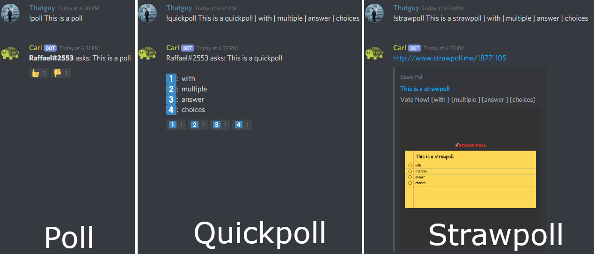

# Infomation/Polls

### Information

???+ tldr "Information Commands"
	| Name | Example | Usage |
	| :--- | :--- | :--- |
	| [i\|info] [@member/ID] | !i @Carl\#0001 | Returns the specified user's name, avatar link, roles, ID, creation date, server join date and some cool related information. |
	| avatar [@member/ID] | !avatar @Carl\#0001 | Shows the avatar of a mentioned user or yourself if you don&apos;t. Works even if the user doesn&apos;t share a server with the bot. Also works in dms, you creeps. |
	| serverinfo | !serverinfo | Displays server information. |
	| **youngest [count=5]** | !youngest 10 | Ranks up to 25 members by account creation. Defaults to 5 if unspecified - Requires Manage Messages |
	| **oldest [count=5]** | !oldest 15 | Ranks up to 25 members by account creation. Defaults to 5 if unspecified - Requires Manage Messages |
	| **[newmembers\|newusers] [count=5]** | !newusers 10 | Ranks up to 25 members by server join date. Defaults to 5 if unspecified - Requires Manage Messages |
	| **[oldmembers\|oldusers] [count=5]** | !oldusers 15 | Ranks up to 25 members by server join date. Defaults to 5 if unspecified - Requires Manage Messages |
	| wolfram | !wa e ^ (pi * i) + 1 | This is similar to going to wolframalpha and entering the text yourself. Doesn&apos;t support complicated answers. |
	
### Polls

???+ tldr "Poll Commands"
	| Name | Example | Usage |
	| :--- | :--- | :--- |
	| poll &lt;question&gt; | !poll should I sleep? | Creates a yes/no poll where users can vote with reactions. |
	| quickpoll &lt;question \| answers...&gt; | !quickpoll best game?\| wow \| overwatch \| only losers play games | Use pipes \| or commas to separate the question and answers. The first arg is the question, all after that are individual answers. You can&apos;t mix pipes and commas, pipes are intended for polls where you want commas in the question or answer. |
	| strawpoll &lt;question \| answers...&gt; | !strawpoll best bot?\| carl-bot \| other inferior bots | Generates a [strawpoll.me](https://www.strawpoll.me/) poll using the question and answers provided, using the same syntax as `quickpoll` |

	